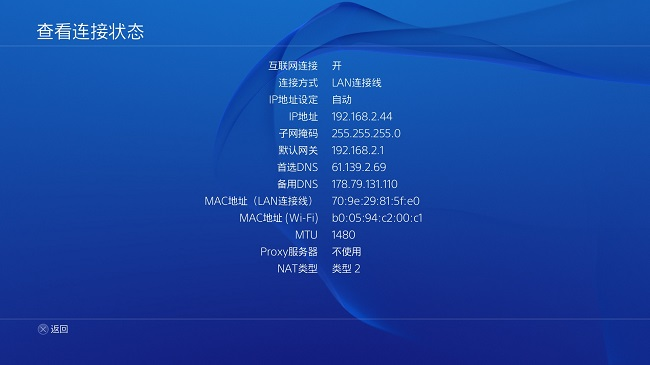

# 加快游戏联机-设置MTU优化网络

---

**什么叫MTU，设置好有什么用有什么好处（以及设错了会发生什么杯具），这里都不再细说，请朋友们自行百度。简而言之，我是这样理解的：DMZ主机/NAT类型的正确配置改善你和对手能否连上；而MTU的正确设置，让你的网络传输更高效，在一定程度上减少点延时和丢包情况。具体效果有多大因人而异（当年玩大菠萝，有人设了之后直接平均下降30ms+的延时，有人设了没什么大的感觉），总之设好总比不管不顾好。看不懂的大可以不百度、不看，这里直接说怎么设置。**

**一、首先是探测出适合你自身网络的MTU值：**

1、Win+R打开“运行”菜单，输入`cmd`并回车；
2、在“命令提示符”窗口中输入`ping -l 1472 -f www.baidu.com`，回车；
3、如果提示“需要拆分数据包但是设置 DF”，那就说明数据包大小超过了网络限定的MTU大小，就需要逐步减小上面`1472`那个数字，推荐每次减小`5`，直到提示`来自xxx.xxx.xxx.xxx的回复：字节=XXXX 时间=XXms TTL=XX`为止  
然后开始每次加`1`，直到不能再加1（加了就会提示需要拆分）为止。
此时得到了这个最大的数字，比如我的是1452

加上28，记住这个数字。比如我是记1452+28=1480

**二、Vista、Win7、Win8系统的设置方法：**  

1、Win+R，Alt+D，输入`%SystemRoot%\system32\`，回车。找到cmd.exe，右键`以管理员身份运行`；（Win8下可以直接右键左下角徽标，选择“命令提示符（ 管理员）”）
2、在`命令提示符`窗口中输入`netsh interface ipv4 show subinterfaces`并回车来查看当前的mtu值
3、输入`netsh interface ipv4 set subinterface `需修改的连接名` mtu=刚才那个数字 store=persistent`回车
例如：`netsh interface ipv4 set subinterface 本地连接" mtu=1480 store=persistent`

**三、XP系统的设置方法：**

​1、Win+R，调出“运行”菜单，输入`regedit`，回车，打开注册表编辑器；
​2、依次选择节点`HKEY_Local_Machine=>SYSTEM=>CurrentControlSet=>Services=>Tcpip=>Parameters=>interface`；
​3、在interface里有很多项，逐个观察“键值”，会有一项与你的网卡IP一致，选中该项；
​4、然后在该项上点击右键，`选择编辑=>新建=>DWORD值`，重命名为`mtu`；5、双击你刚才新建的`mtu`，在`基数`那儿选择`十进制`，然后填入你刚才的那个数字即可。

**四、PS4里的设置方法：**

设定=>网络=>设定互联网连接=>选好LAN/WIFI连接方式=>定制=>之后的倒数第二步就会问你MTU是自动还是手动配置，选择手动，并填入刚才的数字即可
之后在 设定=>网络=>查看连接状态 里 就可以看到
比如我把他由默认的1500改成了1480，如图所示：

---

**警告:BooCloud WIki提供的扩展教程不保证对所有用户有效！**
