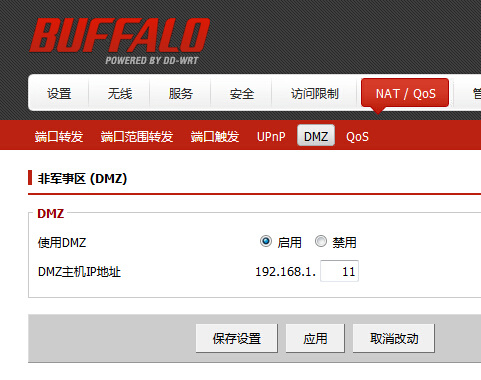
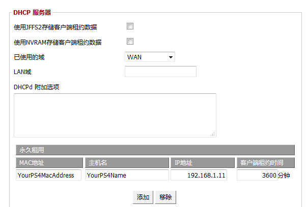

# PS4/PS3/Xbox-联机网络优化

---

> **对于某些NAT3/NAT4和移动/其他宽带的用户，可能您在使用了BoomCloud的云加速连接以后仍然无法获得最佳的联机体验，那么这里将有教程可以帮助您。**

**我们可以利用DMZ的特性,将PS4/PS3主机置于DMZ.**

**1.首先确定自己的路由器支持DMZ,然后打开路由器设置界面,找到DMZ.**

启用DMZ,填写主机的IP地址,保存并生效.
为了避免浮动IP每次需要设置,我们需要进行IP-Mac绑定.如果你已经绑定,那么无需继续操作,可以直接使用了.

**2.下面是IP-Mac绑定**

毕竟路由器型号众多,就不一一举例了,自己找一下很快就找到了.
这一台的绑定设置是在DHCP下面.

按照你的路由器上的格式填写好主机的Mac地址,名称和你要分配给的内网IP.
保存后,返回DMZ设置,把你刚才分配的IP地址填上.
保存并生效.
然后就可以愉快地玩耍了.

**附: [来自于互联网的其他进阶教程](http://forum.17fifa.com/thread-271303-1-1.html)**

---

**警告:BooCloud WIki提供的扩展教程不保证对所有用户有效！**
