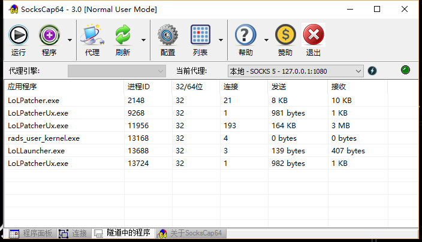

# 扩展教程--SocksCap64配合SSR  玩游戏

---
**最近很多人反映开SS玩儿游戏很卡，首先要普及的是SS直接用并不适用于打游戏，各种游戏不同数据传输协议也不同，所以做任何事情之前动动脑子，别只想着打游戏，打游戏都不动脑子可见你游戏玩儿的也不怎么地，对吧？好了今天给大家介绍下如何用SocksCap64+Shadowsocks玩外服游戏，以LOL为例，本文的SocksCap64相对来说配置会更加简单一点。**

* 首先，下载SocksCap64，[下载地址](https://sourceforge.net/projects/sockscap64/files/?source=officialsite)

* 下载后运行，点击那个+号添加一个代理服务器，因为我们是配合Shadowsocks，所以ip填写127.0.0.1，端口1080，类型SOCKS 5，其他空白。

* 设置完毕后点击测试按钮测试下代理是否可用。

* 接着把lol的快捷方式拖进去，然后点击运行按钮。

* 在SocksCap64软件的下方，切换到隧道中的程序，就可以看到所有和LOL相关的程序都通过这个软件走了代理。

* 通常情况这样就可以直接玩游戏了。

* 非通常情况：有些时候游戏对游戏ip有要求，必须要当地原生ip，这种需要不断的去测试，找一个当地原生ip的服务器才能玩。另外就是有些游戏可能需要额外添加启动参数才能玩，具体的Google。
---

特别提示：本教程转载自互联网，如无法成功或无效，请自寻谷歌。

