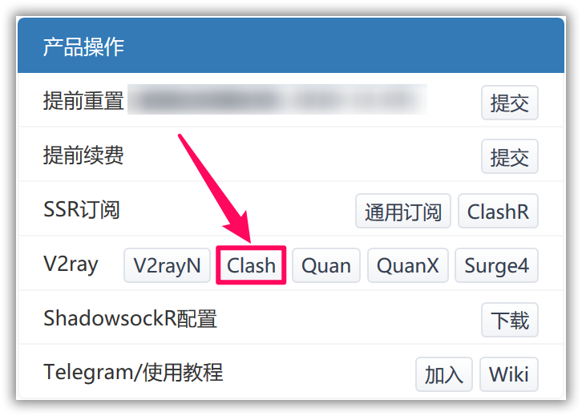
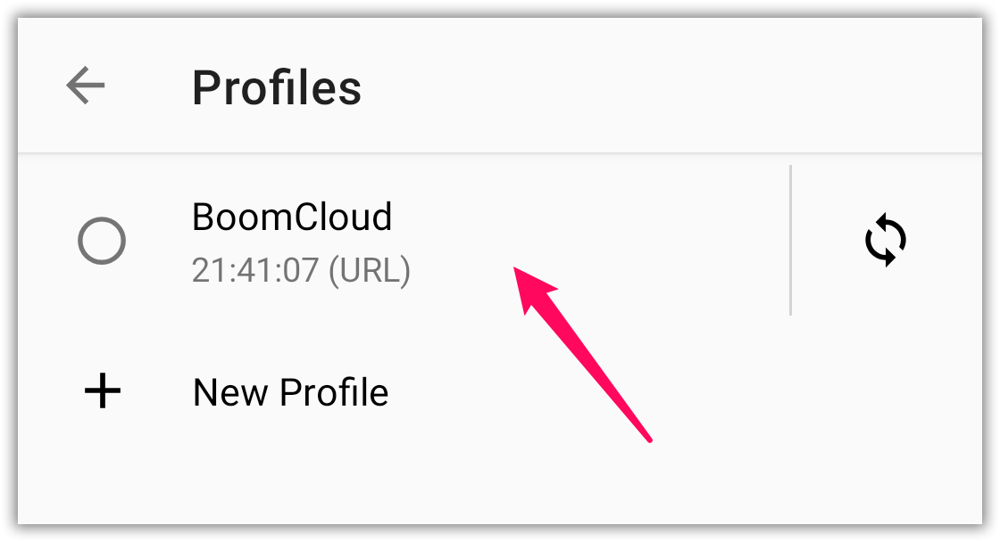
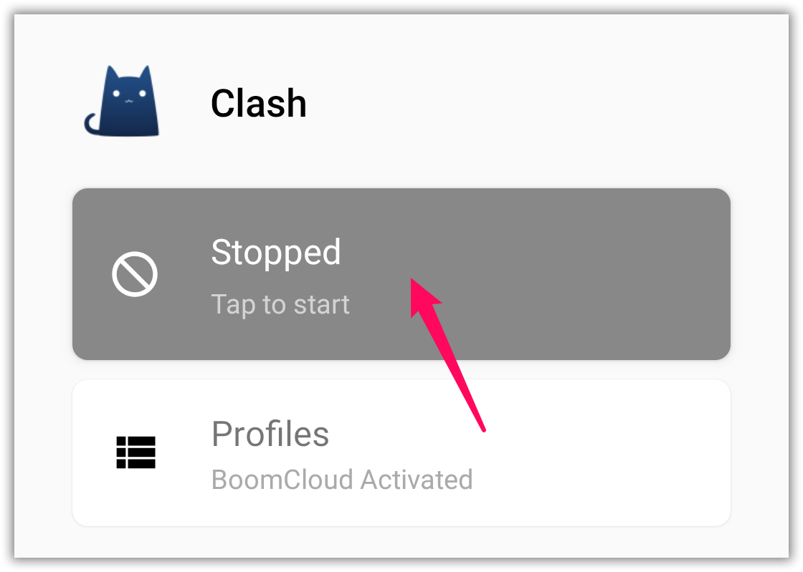
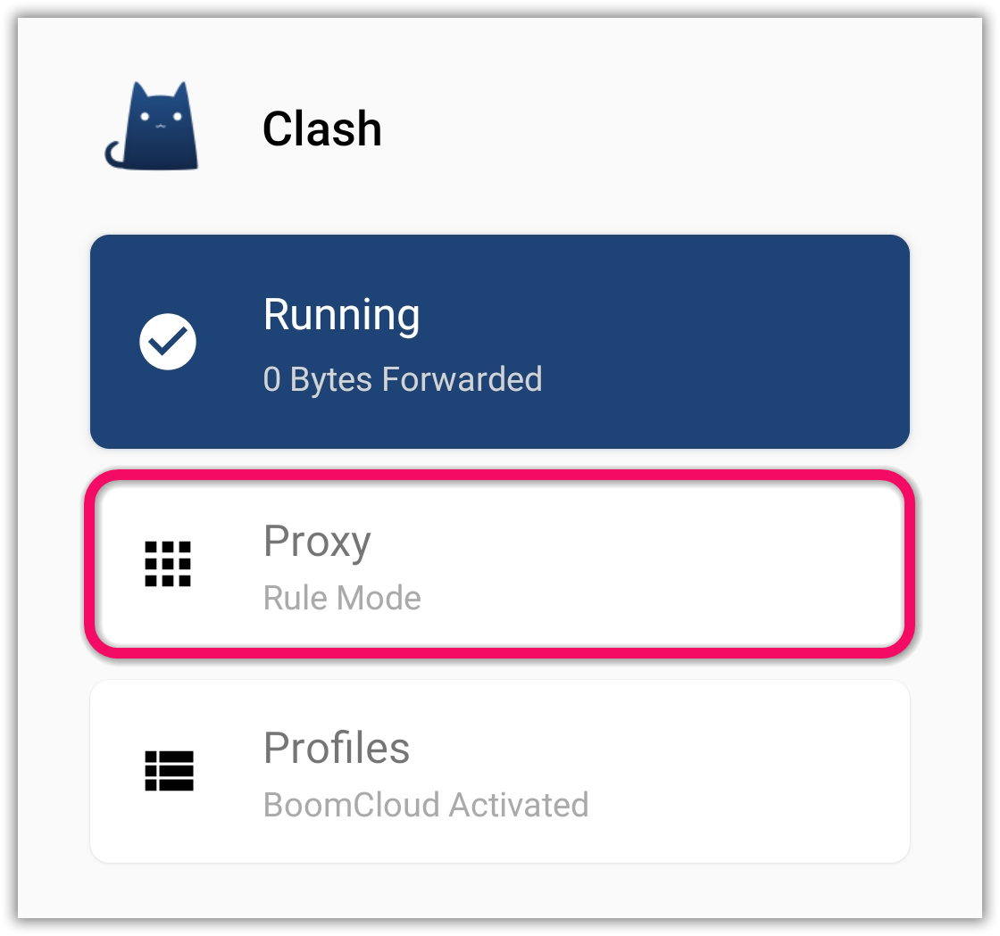
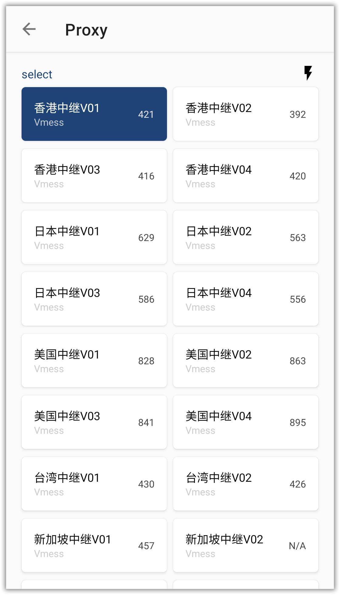
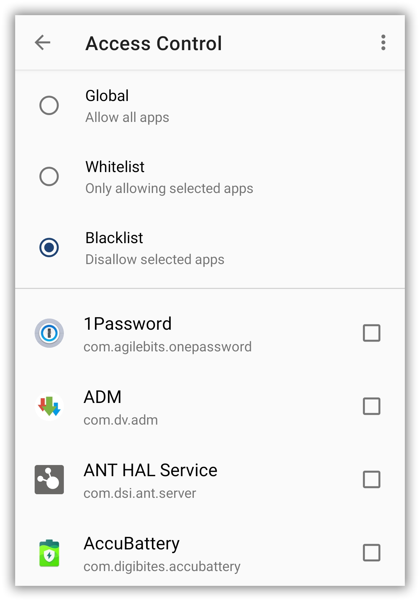

# 使用教程 —— Clash for Android

- - -

!>系统环境： Android 10, Clash for Android 1.0.32-alpha

**下载和安装 Clash for Android**

点击[这里](https://cdn.t9c.co/download/clash_1.2.6.apk)下载 Clash for Android

---

**1. 使用浏览器登录到 BoomCloud 管理门户**

建议使用 Chrome 浏览器，访问 BoomCloud 管理门户，点击您的订阅进入订阅详情页面

**2. 导入 BoomCloud 接入点信息**

点击订阅打开订阅详情页面，找到「产品操作」功能区，然后点击「Clash」按钮。

点击之后会自动复制托管链接至剪贴板，部分浏览器会弹出提示

运行 Clash for Android 后，依次点击「Profiles – New Profile – URL」，点击「Name」输入任意名称，点击「URL」粘贴之前复制的托管链接，点击右上角✔保存

点击选中添加成功的托管配置。配置名称右侧是订阅更新按钮，BoomCloud 的服务器信息会不定时更新，如若出现大面积节点超时现象，可尝试手动更新订阅。

**3. 配置客户端**

回到应用主界面，点击最上方开关连接代理服务器，如果是首次连接，则系统会弹出权限提示框，请点击「确定」授予应用 VPN 连接权限

连接成功后可以点击「Proxy」选项卡，进入策略组面板，在这里可以切换节点，直接点击想要使用的节点即可进行切换

点击⚡按钮可以进行延迟测试，测试结果将显示在节点名称右侧。注意：延迟和速度并不成正比，BoomCloud 只致力于提高速度，游戏等对于低延迟有较高需求的请购买专业游戏加速器

**4. 分应用代理**

从主界面依次点击「Settings - Proxy - Access Control」，应用提供「全局/白名单/黑名单」三种模式，默认是全局模式，可通过策略组规则进行分流。白名单模式即是勾选的应用走代理，黑名单模式则相反

- - -
注意事项：  
1. 个人专属配置文件是你个人账号密码及节点的总集成，不能泄露给任何人及网络，以防止他人使用及知晓你的密码。  
2. 如果节点有更新，则需要再次导入配置文件进行更新。  
3. Clash for Android 如果出现 BUG 请联系软件作者反馈，BoomCloud 无法也没有义务解决客户端层面问题。
