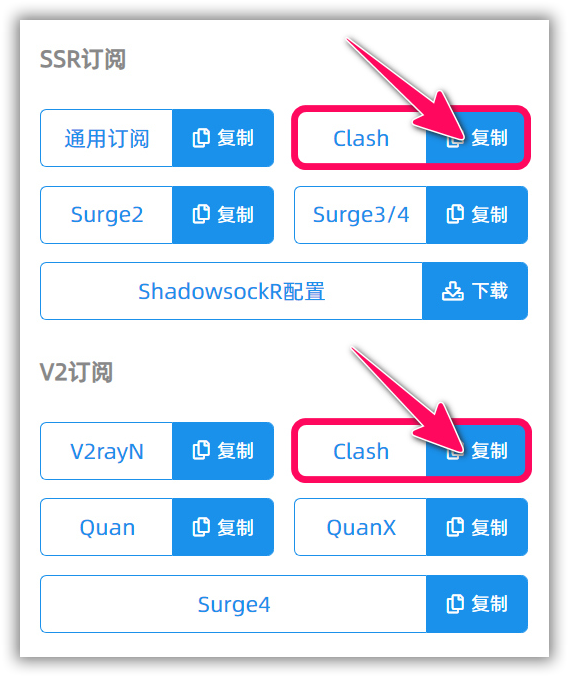
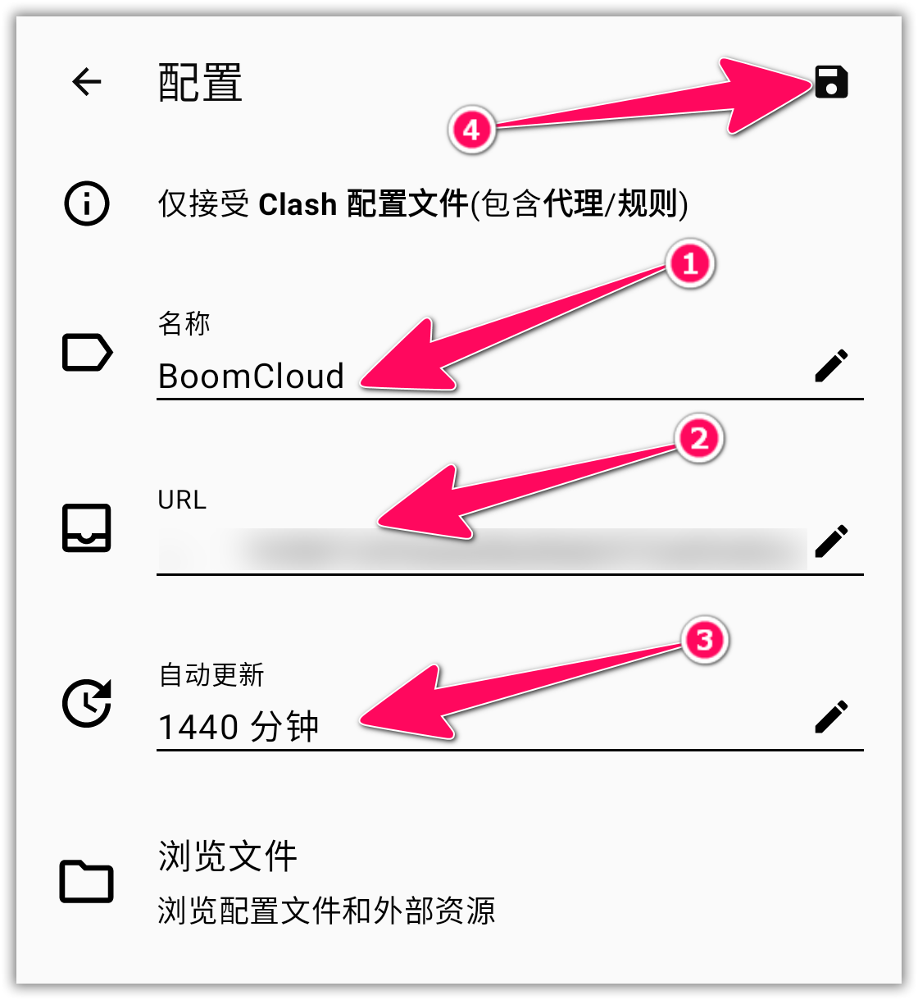
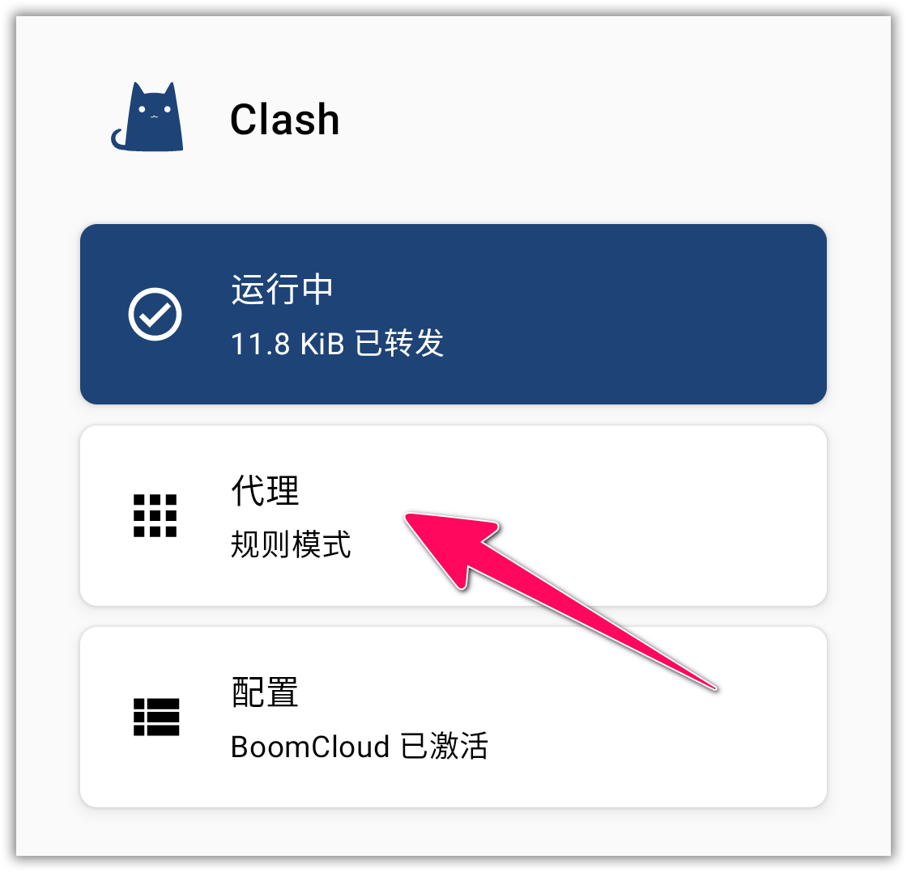
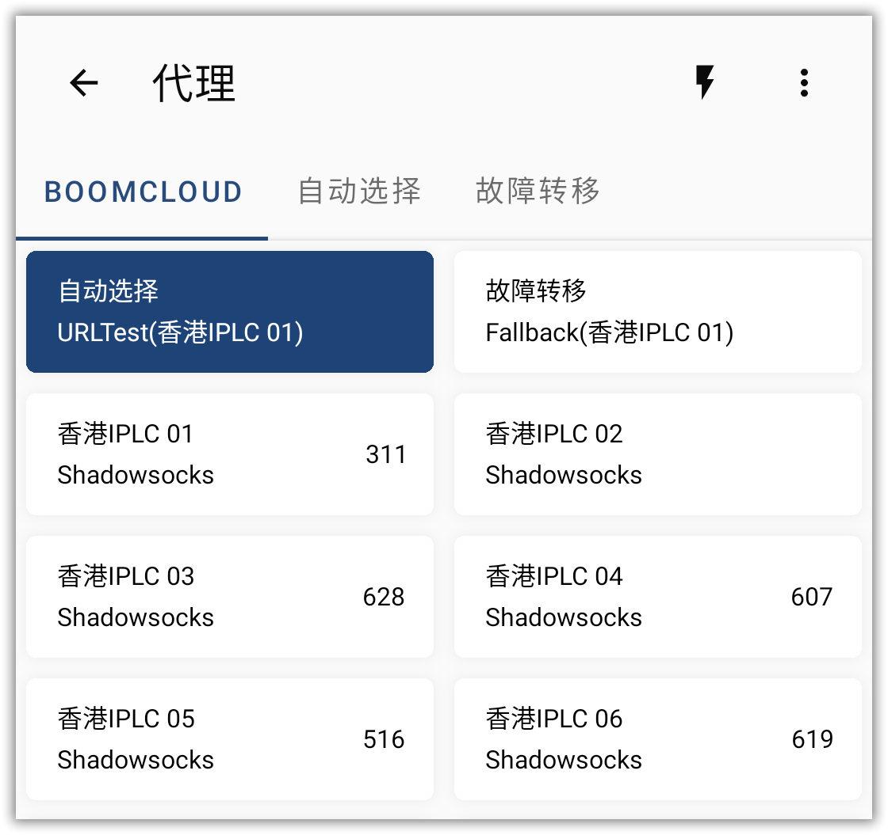

# 使用教程 —— Clash for Android

- - -

!>系统环境： Android 11 / Clash for Android 2.5.3.premium

**下载和安装 Clash for Android**

下载地址：
- [国内 CDN 托管](https://cdn.t9c.co/download/Clash2.1.6.apk)
- [官方 Github](https://github.com/Kr328/ClashForAndroid/releases/download/v2.5.3/cfa-2.5.3-premium-arm64-v8a-release.apk)

**注意事项：**  

!> BoomCloud 将提供关于此应用程序的配置和使用支持服务，然而，由于此应用程序并非 BoomCloud 开发，我们的支持人员培训程度也并不相同，我们建议如果用户使用过程中出现应用程序方面的问题，优先考虑询问开发者，或自行使用搜索引擎寻求解决方案。

---

**1. 登录 BoomCloud 用户中心**

建议使用 Chrome 浏览器，访问 BoomCloud 用户中心，在「您已激活的产品」区域，找到生效中的套餐，点击进入套餐管理页面。在节点订阅模块可以分别订阅 SSR/V2Ray 不同协议的节点，点击复制 Clash 的订阅链接

**2. 导入 BoomCloud 接入点信息**

安装运行 Clash for Android ，进入「配置」界面，点击右上角的加号，选择`从 URL 导入`，在`名称`输入框内可对节点分组自定义名称¹，将订阅链接粘贴至`URL`输入框²，`自动更新`输入框可设置配置文件自动更新的时长³，可按需设置或不设置，全部参数填写完毕点击右上角保存按钮⁴

点击选中导入成功的配置文件¹，界面右上方为手动更新按钮²，BoomCloud 的服务器信息会不定时更新，如若出现大面积节点超时现象，可尝试手动更新订阅

**3. 配置客户端**

回到应用主界面，点击最上方开关连接代理服务器，如果是首次连接，则系统会弹出权限提示框，请点击「确定」授予应用 VPN 连接权限

连接成功后点击「代理」按钮，进入策略组面板，在这里可以自行切换节点

点击⚡按钮可对所有节点测试延迟，测试结果将显示在节点名称右侧。注意：延迟和速度并不成正比，BoomCloud 只致力于提高速度，游戏等对于低延迟有较高需求的请购买专业游戏加速器

此为 Clash for Android 简明教程，更多功能请自行摸索，或求助于搜索引擎。

- - -
注意事项：  
1. 个人专属配置文件是你个人账号密码及节点的总集成，不能泄露给任何人及网络，以防止他人使用及知晓你的密码。  
2. Clash for Android 如果出现 BUG 请联系软件作者反馈，BoomCloud 无法也没有义务解决客户端层面问题。
