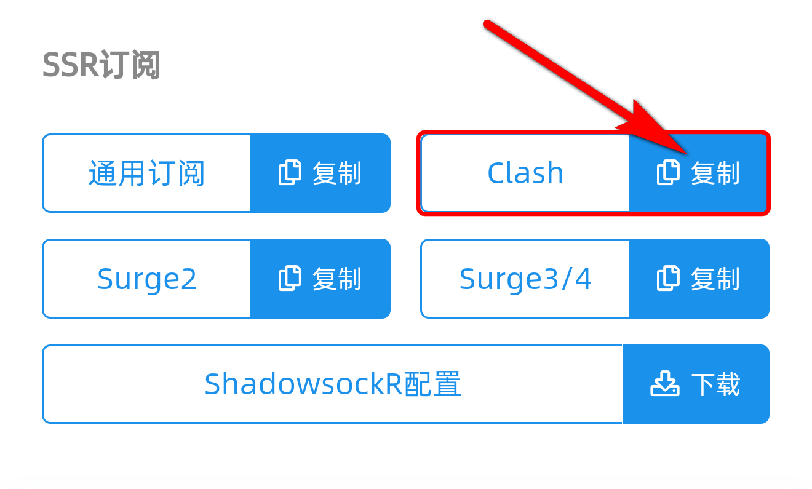
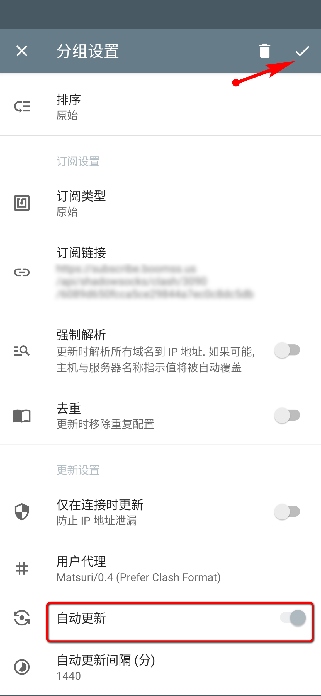
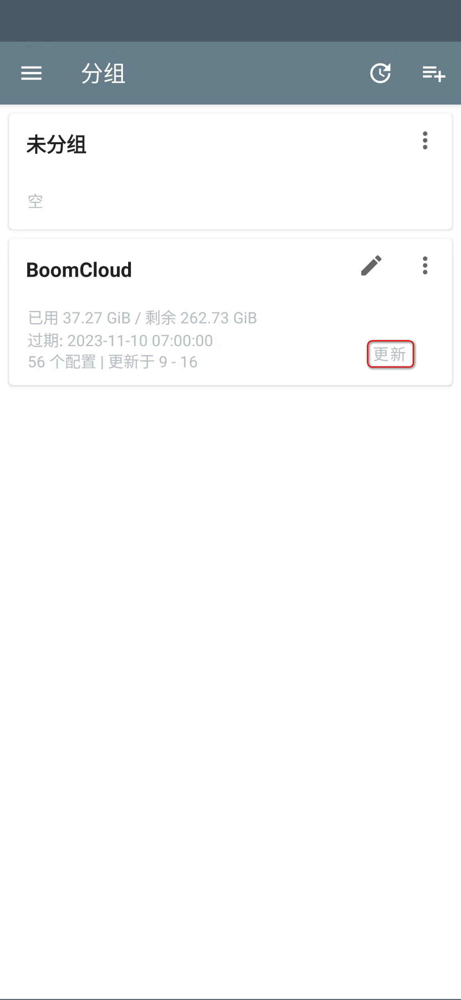
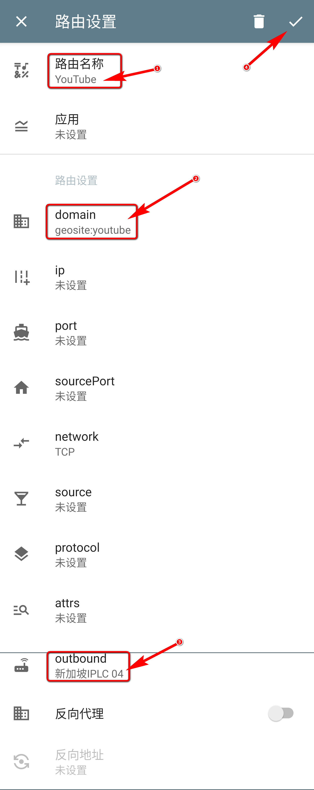
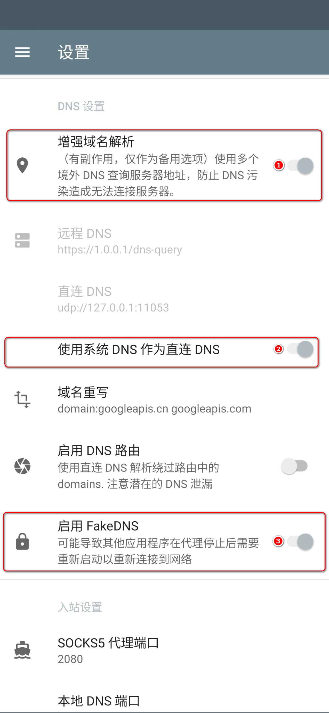
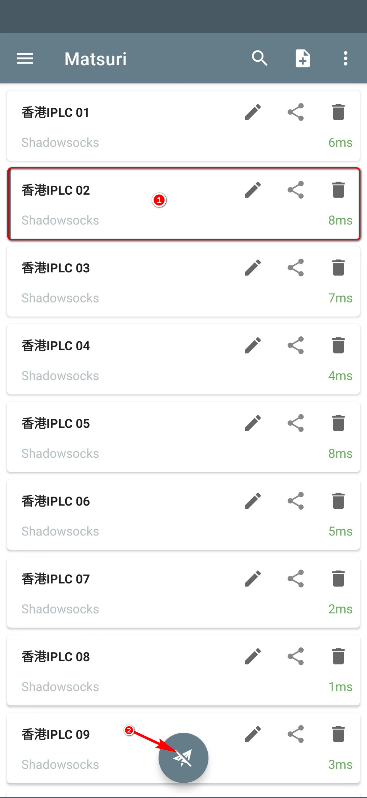

# 使用教程 —— SagerNet & Matsuri

- - -

!>系统环境： Android 13 / Matsuri 0.4.2

**下载和安装 Matsuri**

下载地址：
- [官方 Github](https://github.com/MatsuriDayo/Matsuri/releases/download/0.4.2/Matsuri-0.4.2-arm64-v8a.apk)

**注意事项：**  

!> BoomCloud 将提供关于此应用程序的配置和使用支持服务，然而，由于此应用程序并非 BoomCloud 开发，我们的支持人员培训程度也并不相同，我们建议如果用户使用过程中出现应用程序方面的问题，优先考虑询问开发者，或自行使用搜索引擎寻求解决方案。

---

**1. 登录 BoomCloud 用户中心**

建议使用 Chrome 浏览器，访问 BoomCloud 用户中心，在「您已激活的产品」区域，找到生效中的套餐，点击进入套餐管理页面。点击复制 Clash 的订阅链接

**2. 导入 BoomCloud 接入点信息**

安装运行 Matsuri ，展开侧栏界面，点击分组，点击右上角添加分组，设置分组名`BoomCloud`,分组类型选择`订阅`， 在`订阅链接`输入框内粘贴复制的链接¹，`自动更新`输入框可设置配置文件自动更新的时长，可按需设置或不设置，全部参数填写完毕点击右上角保存按钮

 

卡片右下方为手动更新按钮，BoomCloud 的服务器信息会不定时更新，如若出现大面积节点超时现象，可尝试手动更新订阅

**3. 配置客户端**

回到侧栏界面，点击路由，预制路由规则建议全部打开。以 Youtube 分流规则为例，演示添加自定义规则分流

点击右上角`新建路由规则`，`路由名称`填入`Youtube`,`domain`填入`geosite:youtube`,`outbound`根据需求选择，如演示图片中选择了`新加坡IPLC 04`

更多 geosite 分类见 [@v2fly/domain-list-community/data](https://github.com/v2fly/domain-list-community/tree/master/data)

建议的 DNS 配置，侧栏界面点击设置，`DNS 设置`，开启`增强域名解析`、`使用系统 DNS 作为直连 DNS`、`启用 FakeDNS`.可有效防止 DNS 泄露

回到应用主界面，选择要连接的节点，点击下方连接按钮，如果是首次连接，则系统会弹出权限提示框，请点击「确定」授予应用 VPN 连接权限

此为 Matsuri 简明教程，更多功能请自行摸索，或求助于搜索引擎。

- - -
注意事项：  
1. 个人专属配置文件是你个人账号密码及节点的总集成，不能泄露给任何人及网络，以防止他人使用及知晓你的密码。  
2. Matsuri 如果出现 BUG 请联系软件作者反馈，BoomCloud 无法也没有义务解决客户端层面问题。
