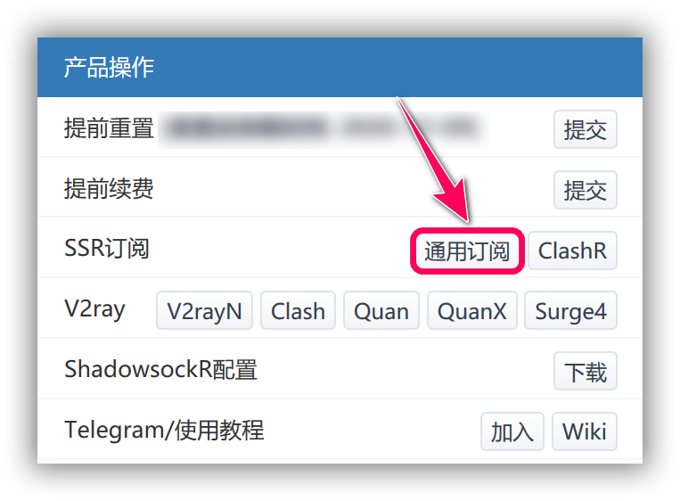
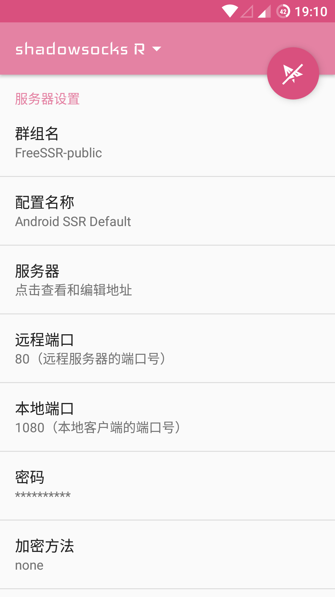
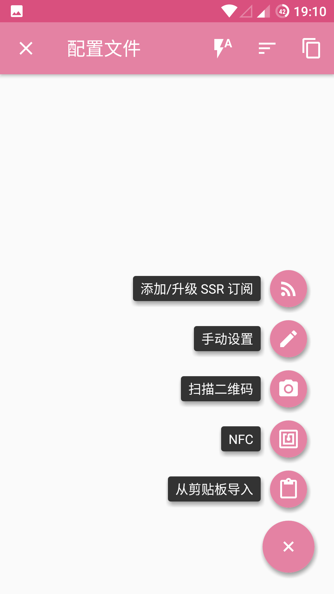
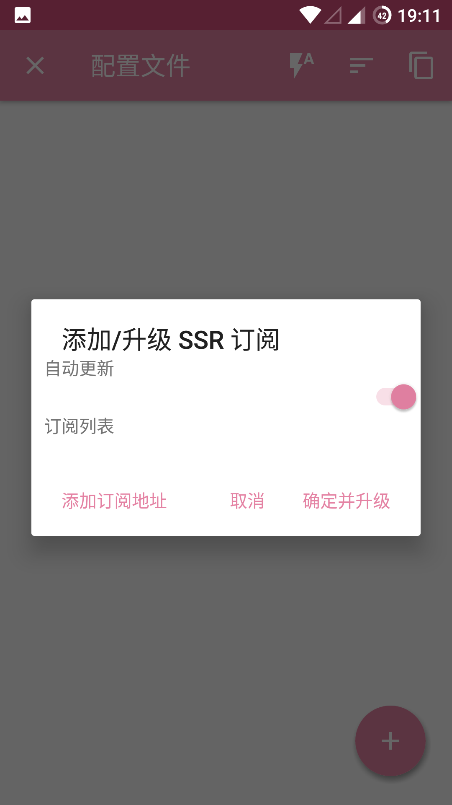
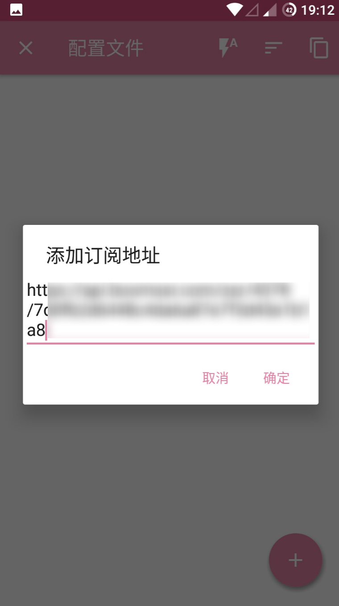
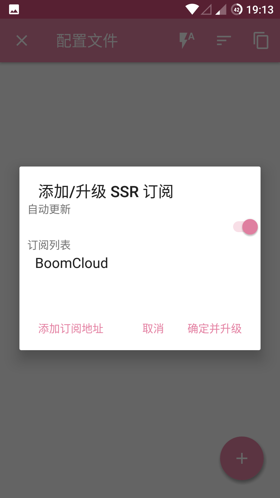
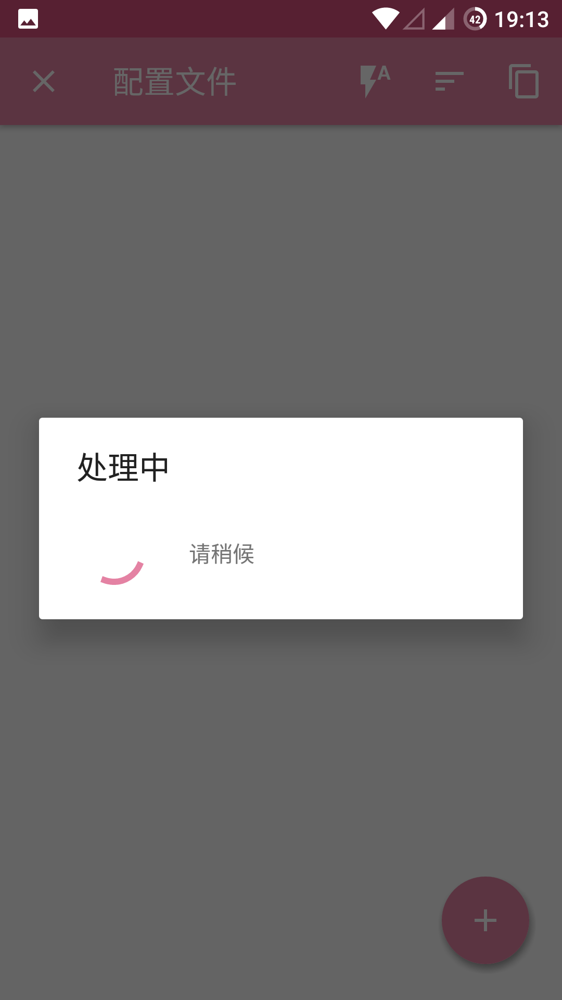
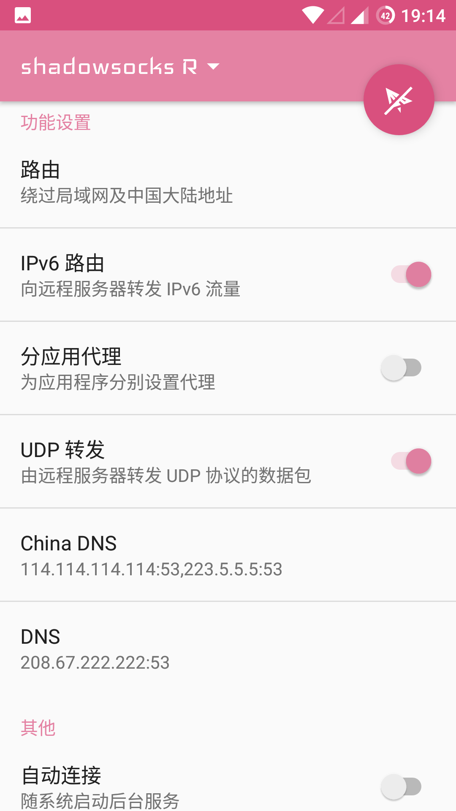
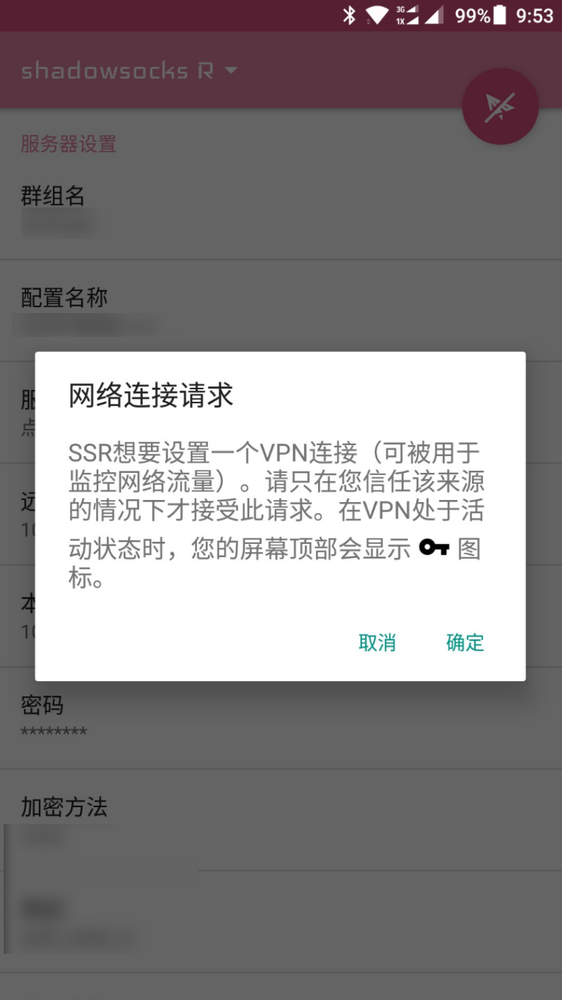

# 使用教程 —— Android

---

** 1. 使用手机默认浏览器，进入用户中心**

建议使用 Chrome 访问 BoomCloud 管理门户，登录用户中心，在"您订购的产品" 区域，找到 云加速 服务，点击进入产品详情页面。

**2. 导入 BoomCloud 接入点信息**
点击订阅打开订阅详情页面，然后找到「产品操作」功能区。然后点击「通用订阅」按钮，点击之后会自动复制成功，部分浏览器会弹出提示

打开 ShadowsocksR 应用程序，然后点击顶部的「ShadowsocksR」区域进入接入点列表

在接入点列表页面点击底部的「+」按钮，并选择「添加/升级 SSR 订阅」

在弹出的窗口中右划删除模式的示例订阅，然后打开「自动更新」，并点击「添加订阅地址」。

长按文本框空白区域，选择「粘贴」，将 BoomCloud 接入点订阅 URL 粘贴到文本框中。点击「确定」。

ShadowsocksR 应用程序显示「处理中」。这可能需要一小段时间，具体根据网络情况而定。

添加完毕后，就可以看到 BoomCloud 的接入点订阅。点击「确定并升级」就可以导入最新的 BoomCloud 接入点信息并自动更新了。

**3.配置 ShadowsocksR 应用程序**

导入接入点信息后，返回到主页面，然后下滑到「功能设置」功能区，打开「UDP 转发」和「IPv6 路由」，并设置「路由」为「绕过局域网和中国大陆地址」，以获取最佳 BoomCloud 体验。

滑动页面到顶部，点击纸飞机图标连接，如果是首次连接，则系统会弹出如下的提示框，请点击「确定」。

---

**注意事项:**

* 个人专属配置文件是你个人账号密码及节点的总集成，不能泄露给任何人及网络，以防止他人使用及知晓你的密码。  
* Android 版 SSR 软件来自网络，并未在 Google Play 中销售，请注意下载来源。  
* 软件如果出现 BUG 请联系软件作者，BoomCloud 无法解决客户端层面问题。  
