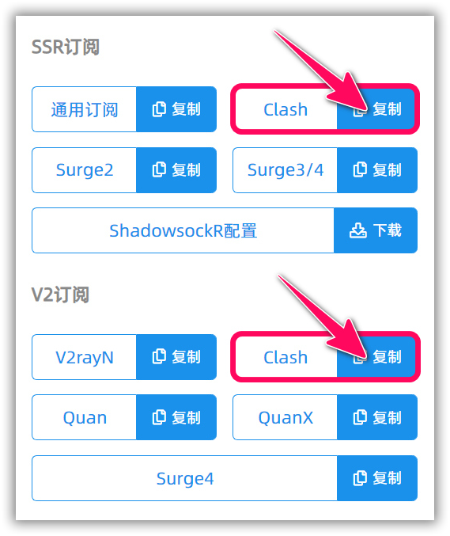

# 使用教程 —— Clash for Windows
- - -

!>系统环境： Windows 11 Pro 21H2 / Clash for Windows 0.19.0

**下载和安装 Clash for Windows**

下载地址：
- [国内 CDN 托管](https://cdn.t9c.co/download/Clash.for.Windows.Setup.0.13.6.exe)
- [官方 Github](https://github.com/Fndroid/clash_for_windows_pkg/releases/download/0.19.0/Clash.for.Windows.Setup.0.19.0.exe)

运行 Clash for Windows 需要管理员权限，请确保在 UAC 授权中允许

---
**1. 登录 BoomCloud 用户中心**

建议使用 Chrome 浏览器，访问 BoomCloud 用户中心，在「您已激活的产品」区域，找到生效中的套餐，点击进入套餐管理页面。在节点订阅模块可以分别订阅 SSR/V2Ray 不同协议的节点，点击复制 Clash 的订阅链接

**2. 导入 BoomCloud 接入点信息**

安装并运行 Clash 客户端，点击「Profiles」按钮¹，在输入框内填入复制的订阅链接² ，注意检查地址以`https://subscribe.boomss.host/XXXXX`开头，点击「Download」按钮下载配置文件³

  

配置下载成功后会如下图显示「Success!」	，并在下方显示新增的配置文件，选中配置文件

点击「Proxies」按钮¹，在 select 策略组「BoomCloud」中选择要使用的节点或策略²，「自动选择」策略组可以自动选择延迟最低的节点。另外此处「Global」即全局模式，「Rule」即规则模式，「Direct」即不走代理直连模式。

!>建议阁下默认使用「Rule」模式

点击「General」按钮¹，打开「System Proxy」开关启用系统代理²，建议同时打开「Start with Windows」开关实现开机自启动³

至此，您即可开启膜法网上之旅。

**Tips**

1. 点击策略组右侧的测速图标可对该策略组内所有节点进行延迟测试，点击单个节点名称右侧的延迟可对该节点单独测试延迟

2. 在 Windows 10/11 中，微软限制 UWP 应用访问本地回环地址，这导致 UWP 应用无法直接使用代理。Clash for Windows 集成了 EnableLoopback 程序，在 「General」页面点击「Launch Helper」启动 EnableLoopback 程序

点击 `Exempt All` 勾选所有 UWP 应用¹，然后点击 `Save Changes` 即可²，请注意安装新的 UWP 应用后需要再次手动勾选新添加的应用

3. Clash 支持灵活的策略组配置，可以满足多种分流需求，如下图示例所示，实现不同服务使用特定节点而无需频繁手动切换

更多功能介绍请查阅 [Clash for Windows 官方文档](https://docs.cfw.lbyczf.com/) 或自行 Google
- - -
注意事项：  
1. 个人专属配置文件是你个人账号密码及节点的总集成，不能泄露给任何人及网络，以防止他人使用及知晓你的密码。    
2. Clash for Windows 如果出现 BUG 请联系软件开发者，BoomCloud 无法也没有义务解决客户端层面问题。
