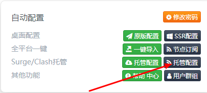
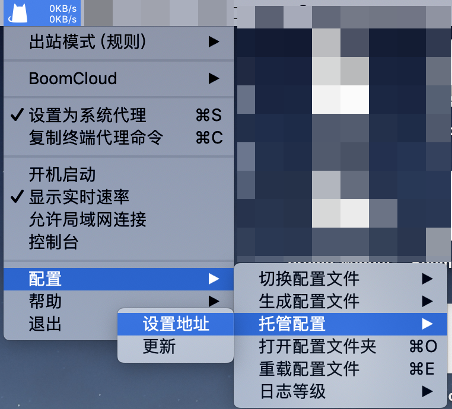
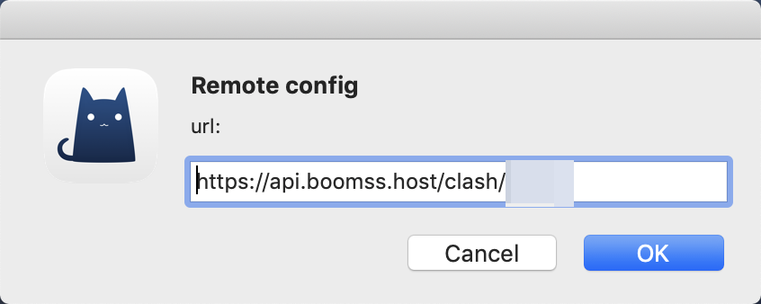
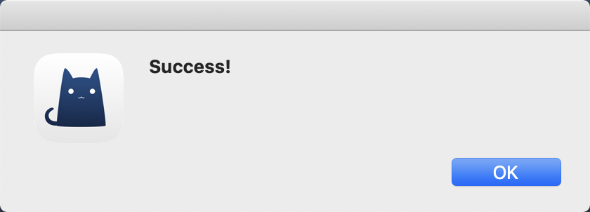
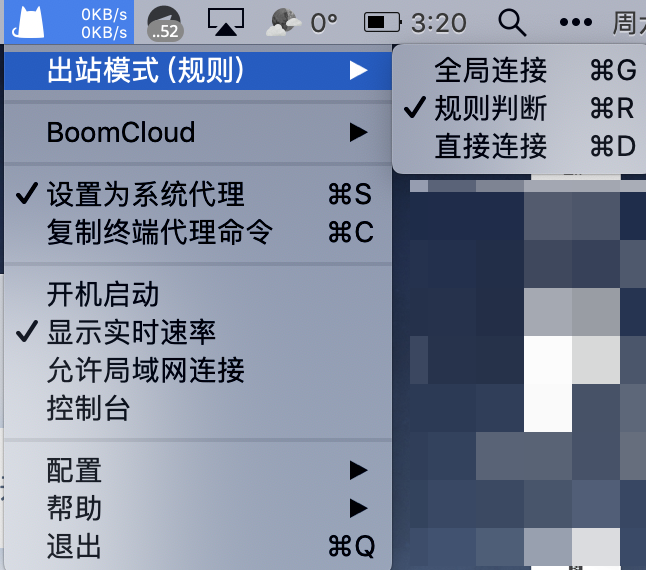

# 使用教程 —— ClashX for macOS

- - -

!>系统环境： macOS 10.14.1    ClashX 1.8.1

**下载和安装 ClashX**

点击[这里](https://github.com/yichengchen/clashX/releases)来下载 ClashX

首次使用 ClashX macOS 会一如既往地提醒你此应用来自未知开发者，请允许打开此应用。

ClashX 首次运行会提示是否安装帮助程序（Helper），此帮助程序用于设置系统代理，否则每次你通过 ClashX 变更系统系统状态（打开或关闭）时都需要输入密码，请点击「Install」，之后 macOS 会提示输入用户密码。

---

**1. 使用桌面浏览器登录到 BoomCloud 管理门户**

建议使用 Chrome 浏览器，访问 BoomCloud 管理门户,点击您的订阅进入订阅详情页面

**2. 导入 BoomCloud 接入点信息**

点击订阅打开订阅详情页面，然后找到「产品操作」功能区。然后点击「Clash」按钮，

点击之后会自动复制成功，部分浏览器会弹出提示

运行 ClashX 后，点击菜单栏上的 Clash 图标（一只小猫咪），在菜单中依次找到「配置 – 托管配置 – 设置地址」并点击。

  

在新窗口中粘贴你之前获得的 BoomCloud API 托管型配置的链接：

点击 OK。稍等片刻（视网络情况而定），你应当可以看到成功提示信息。

之后你就可以在 ClashX 菜单中看到正确添加到 BoomCloud Clash 托管型配置信息：

勾选「设置为系统代理后」后就可以启用 ClashX 并通过它来连接到 BoomCloud 网络了。不过，建议出战模式选择为规则判断，在「BoomCloud」选项中可以自由切换节点，同时建议勾选「开机启动」在开机时自动启动 ClashX 应用程序。

- - -
注意事项：  
1. 个人专属配置文件是你个人账号密码及节点的总集成，不能泄露给任何人及网络，以防止他人使用及知晓你的密码。  
2. 如果节点有更新，则需要再次导入配置文件进行更新。  
3. ClashX 如果出现 BUG 请联系软件作者，BoomCloud 无法解决客户端层面问题。
