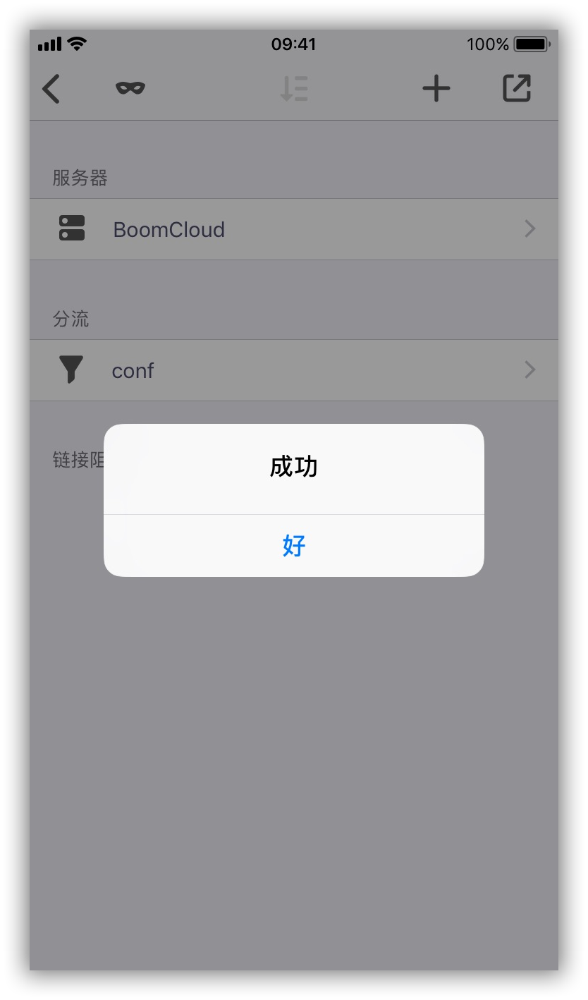

# 使用教程 —— Quantumult

- - -

Quantumult 是新生代的 iOS 代理软件，在完整兼容 SSR 新协议的同时，也兼容 Surge 配置文件的大部分语法和高于 Shadowrocket 的稳定性，是目前在 iOS 设备上使用 BoomCloud 服务的一个较佳选择。

 **购买须知：**

>1.目前此应用程序无法在中国大陆的 App Store 购买和下载，请阁下自备美区 App Store 帐号 ，购买此软件应用程序。  
2.此外，我司不提供任何共享账号，建议阁下通过其他渠道购买帐号或者自行注册。

**注意事项：**  

!> Quantumult 于 2017 年 12 月 02 日正式添加到 BoomCloud 的主流支持中，BoomCloud 将提供关于此应用程序的配置和使用支持服务。然而，由于此应用程序并非 BoomCloud 开发，我们的支持人员培训程度也并不相同，我们建议如果用户使用过程中出现应用程序方面的问题，优先考虑询问开发者。

---

**1. 使用浏览器登录到 BoomCloud 管理门户**

登录用户中心，在"您订购的产品" 区域，找到已激活的产品服务。

点击进入产品详情页面。建议使用 Safari 管理门户，然后点击您的订阅进入订阅详情页面，在「产品操作」功能区点击「通用订阅」，点击之后会自动复制节点订阅链接至剪贴板


**2. 导入 BoomCloud 接入点信息**

打开 Quantumult 软件，点击「设置」标签页，然后点击「订阅」添加订阅


点击右上角的「+」号，并在底部弹出的菜单中选择「服务器」选项


在「名称」中输入「BoomCloud」，在「链接」中粘贴刚才复制的节点信息订阅地址


底部的三个「高级」选项的功能分别为：

```
「部分更新」：仅更新本地存在的节点。即如果勾选此选项，当一个节点在本地不存在，而节点信息订阅中提供了这个节点，那么这个节点不会被添加到本地。

「更新检测」：删除本地节点。即如果勾选此选项，当一个由订阅功能提供的节点在下一次订阅更新时不再存在，Quantumult 也会同时删除本地的对应节点。

「个性化」：保持本地节点名称。即如果勾选此选项，当一个由订阅功能提供的节点在用户手动更新了节点名称后，即使下一次订阅更新时这个节点名称发生了变化，Quantumult 也不会更新本地节点的名称。
```

用户可以根据自身需求选择这些选项，但 BoomCloud 的官方推荐值是仅勾选「更新检测」


点击右上角「保存」，Quantumult 就会返回之前的界面，这时，在刚刚添加的「BoomCloud 」服务器订阅上向左滑动，点击「更新」按钮，Quantumult 就会请求 BoomCloud API 并获取最新的接入点信息。


稍等片刻（视网络情况而定）就会弹出更新成功的弹窗提醒，如果弹出其他提示信息，请联系 BoomCloud 技术支持服务部门。


**添加分流规则**

点击「订阅」 进入订阅管理页面，然后点击右上角的 `+`，在弹出的菜单中选择「分流」


在「名称」中输入 `conf` 并保存，在 「链接」中添加以下链接：  

`https://cdn.t9c.co/quantumult/Default.conf`

点击右上角保存。在分流分类下名称为 `conf`的选项上向左滑动，点击「替换」


Quantumult 会从静态资源服务器上下载分流规则，并在完成后显示更新成功的弹窗提示：



回到应用主界面，点击底部中间的圆形按钮


在弹出的菜单中选择订阅内线路，在节点列表中可以自由点击切换线路，点击左下角按钮可以对所有节点进行延迟测试，寻找最适合您的高速线路


最后切换到「主页 」，点击右上角开关按钮，连接所选服务器


首次使用 Quantumult 系统会弹出 VPN 授权弹窗，请点击允许，跳转到系统设置完成授权


完成授权后回到应用主页，成功开启 BoomCloud 加速服务


- - -
注意事项：  
1. 个人专属配置文件是你个人账号密码及节点的总集成，不能泄露给任何人及网络，以防止他人使用及知晓你的密码。  
2. 如果节点有更新，则需要在订阅管理页面更新订阅。  
3. Quantumult 如果出现 BUG 请联系软件作者，BoomCloud 无法也没有义务解决客户端层面问题。
