# 使用教程 —— Quantumult X

- - -

Quantumult X 是 Quantumult 作者开发的另一款网络代理调试工具，全新的界面设计，支持 SS/SSR, V2Ray (不支持 KCP), Trojan, HTTP(over tls) 协议，支持目前流行的 JavaScript 脚本。

**购买须知：**

>1.目前此应用程序无法在中国大陆的 App Store 购买和下载，请阁下自备其他国家或地区 App Store 帐号 ，购买此软件应用程序。  
2.此外，我司不提供任何共享账号，建议阁下通过其他渠道购买帐号或者自行注册。

**注意事项：**  

!> BoomCloud 将提供关于此应用程序的配置和使用支持服务，然而，由于此应用程序并非 BoomCloud 开发，我们的支持人员培训程度也并不相同，我们建议如果用户使用过程中出现应用程序方面的问题，优先考虑询问开发者，或自行使用搜索引擎寻求解决方案。

---

**1. 使用浏览器登录到 BoomCloud 管理门户**

登录用户中心，在"您订购的产品" 区域，找到已激活的产品服务。

点击进入产品详情页面。建议使用 Safari 访问管理门户，然后点击您的订阅进入订阅详情页面，在「产品操作」功能区点击「通用订阅」或「QuanX」分别订阅 SS(R) 和 Vmess 协议的节点 ，点击之后会自动复制节点订阅链接至剪贴板

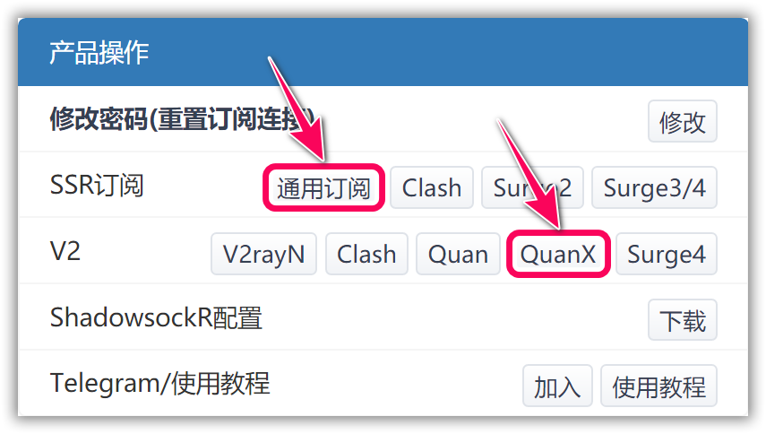

**2. 导入 BoomCloud 接入点信息**

打开 Quantumult X 软件，点击右下角悬浮按钮，然后点击「节点」功能区「引用（订阅）」按钮

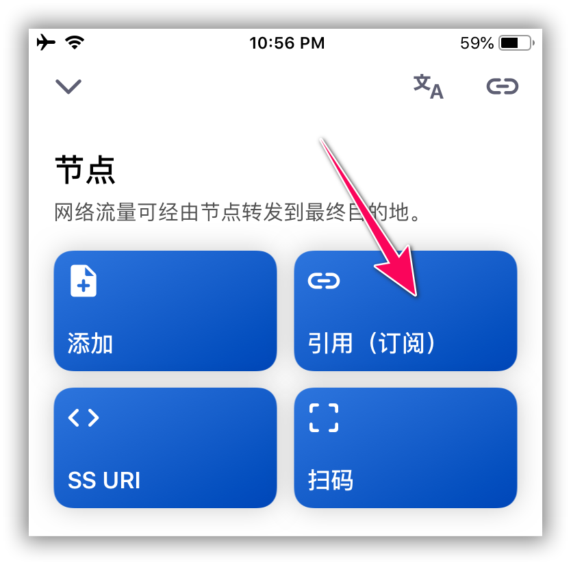

将复制好的订阅链接粘贴进输入框内，点击确定，稍等片刻（视网络情况而定）会弹出更新成功的弹窗提醒，如果弹出其他提示信息，请多尝试几次，或者联系 BoomCloud 技术支持服务部门。

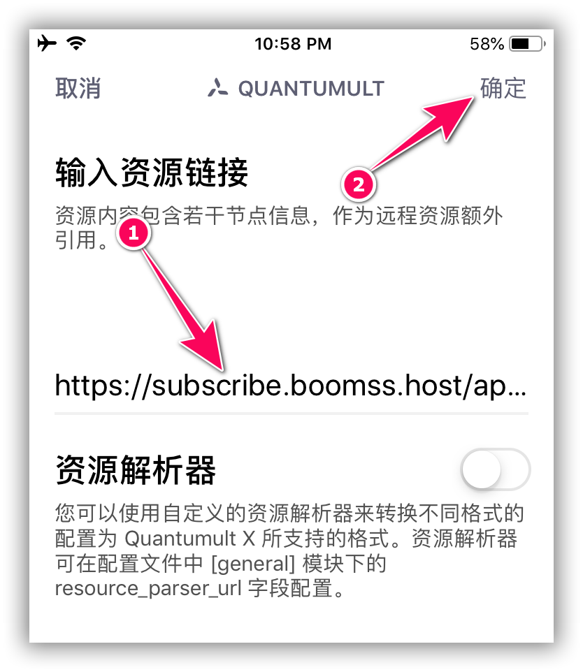

**3. 添加分流规则**

点击「分流」功能区「引用」按钮，将以下链接粘贴至输入框内

`https://cdn.t9c.co/quantumult/x/Pro.conf`

点击确定，稍等片刻（视网络情况而定）会弹出更新成功的弹窗提醒

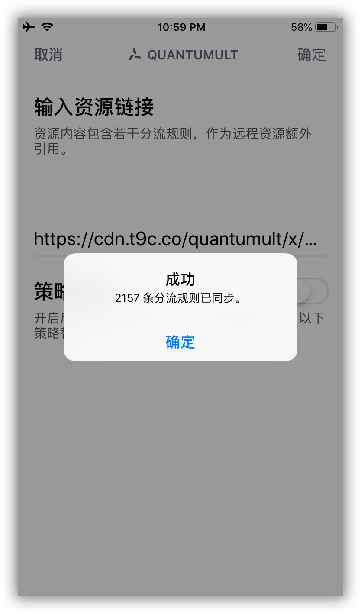

回到应用主界面，可以看到添加的服务器节点信息默认名称是一串随机字符，如果想重命名，可以长按「节点」按钮

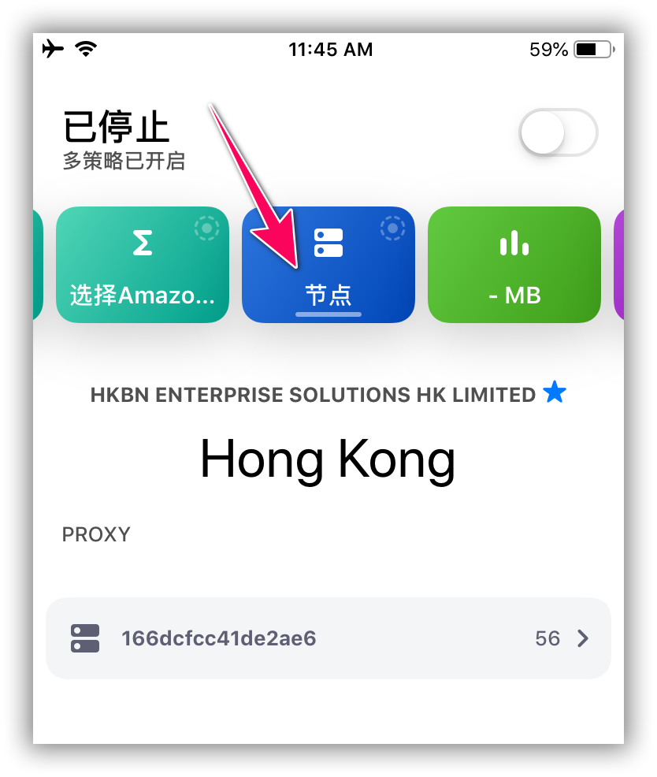

在弹出的资源列表页面内，将需要重命名的条目向左划

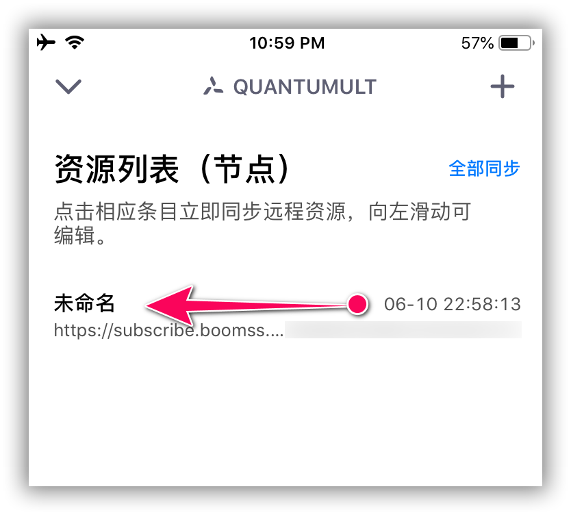

然后点击「标签」按钮，输入自定义名称即可完成重命名。

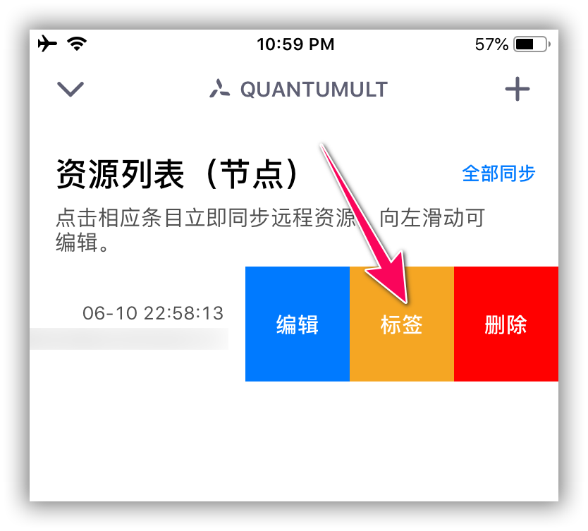

Quantumult X 默认的运行模式是`全部代理`，可以在`设置-其他设置`里修改为`规则分流`模式，或者在主界面长按右下角悬浮按钮，选择第二个图标即可修改为`规则分流`模式

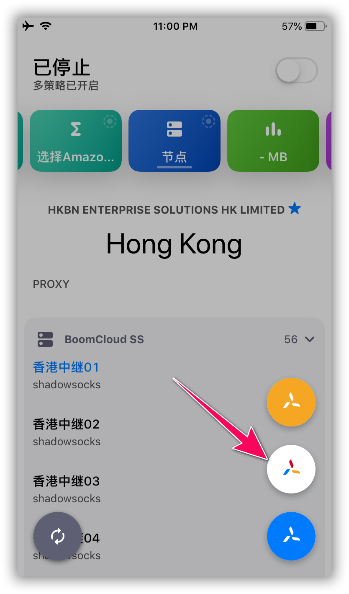

在节点界面，点击展开节点列表，即可自由切换您所购套餐内的线路，下拉此页面可以对所有节点进行延迟测试，寻找最适合您的高速线路（注：延迟高低和线路带宽并无直接关系）

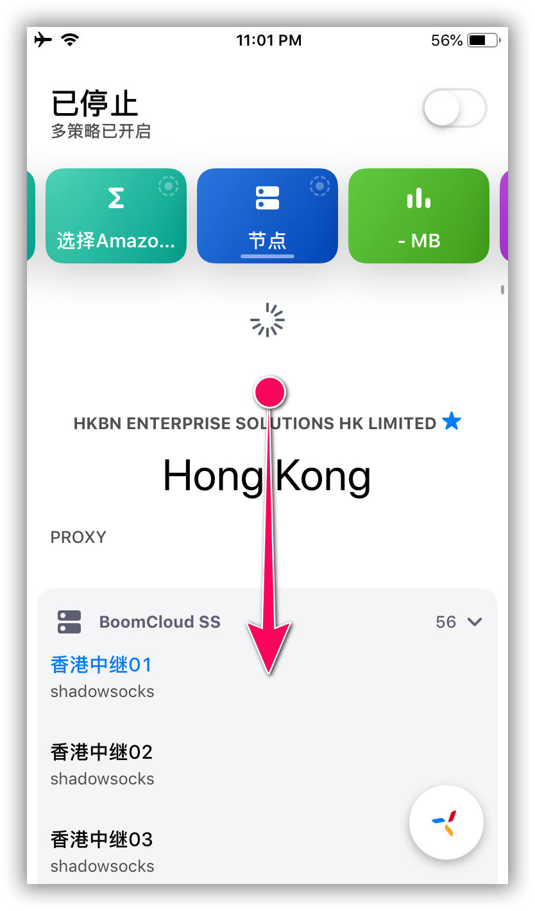

最后点击右上角开关按钮，连接所选服务器。首次使用 Quantumult 系统会弹出 VPN 授权弹窗，请点击允许，跳转到系统设置完成授权，成功开启 BoomCloud 加速服务。

**4. 策略组配置**

Quantumult X 拥有丰富而灵活的策略组功能，简单来说可以实现：
- 「Google」相关请求走`节点 A`
- 「Netflix」相关请求走`节点 B`
- 「微信/优酷」相关请求走`直连`或`回国路线 C`
- 「广告相关/不想访问的网站」请求被拒绝，走 `reject` (当然，去广告实际情况更为复杂，可能需要用到 rewrite 以及 mitm 解密相关的部分)

BoomCloud 提供的分流规则内置了许多策略组，这里以 Netflix 举例，在策略列表里找到 Netflix 策略，长按策略组图标可对其进行自定义配置

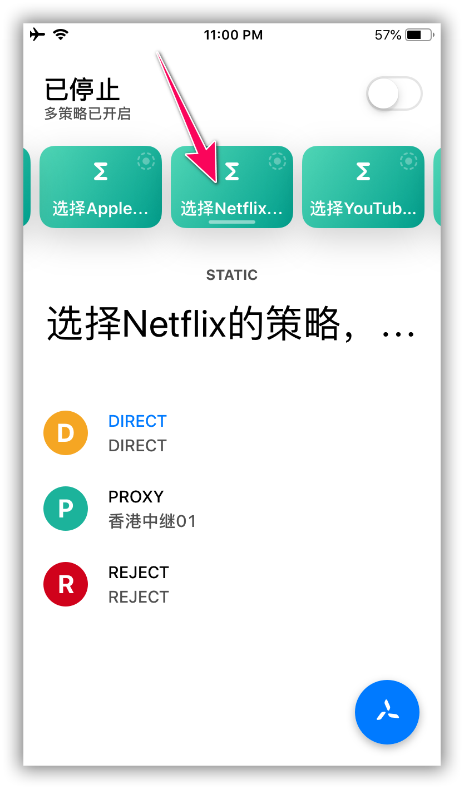

可以自行配置节点线路/子策略，比如把支持 Netflix 的线路添加进策略里，并且可以自行排序。

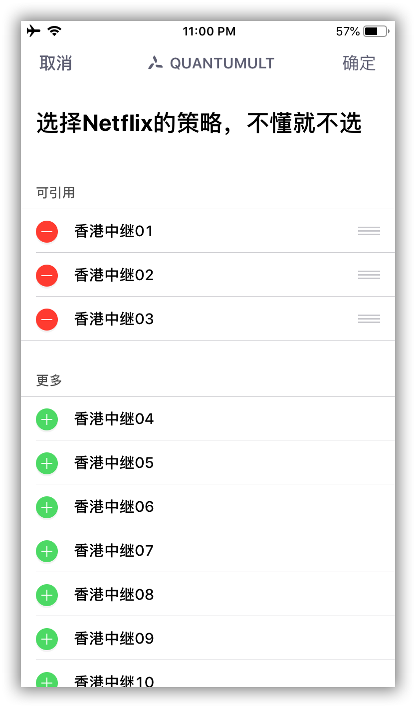

回到主界面，可以手动选择使用的节点。

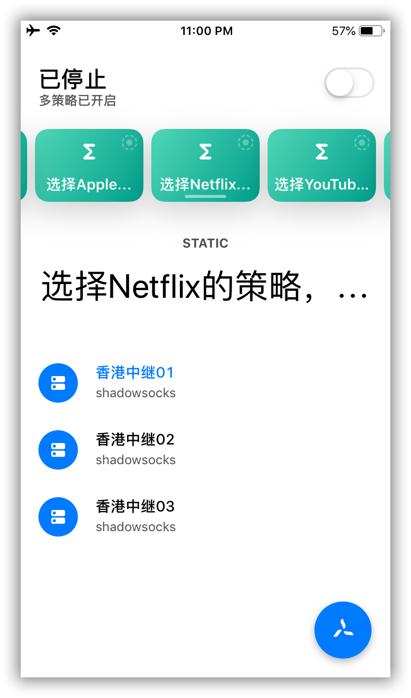

此为 Quantumult X 的简明教程，更多功能请自行摸索，或求助于搜索引擎。
- - -
注意事项：  
1. 个人专属配置文件是你个人账号密码及节点的总集成，不能泄露给任何人及网络，以防止他人使用及知晓你的密码。  
2. 如果节点有更新，则需要在订阅管理页面更新订阅。  
3. Quantumult X 如果出现 BUG 请联系软件开发者，BoomCloud 无法也没有义务解决客户端层面问题。
