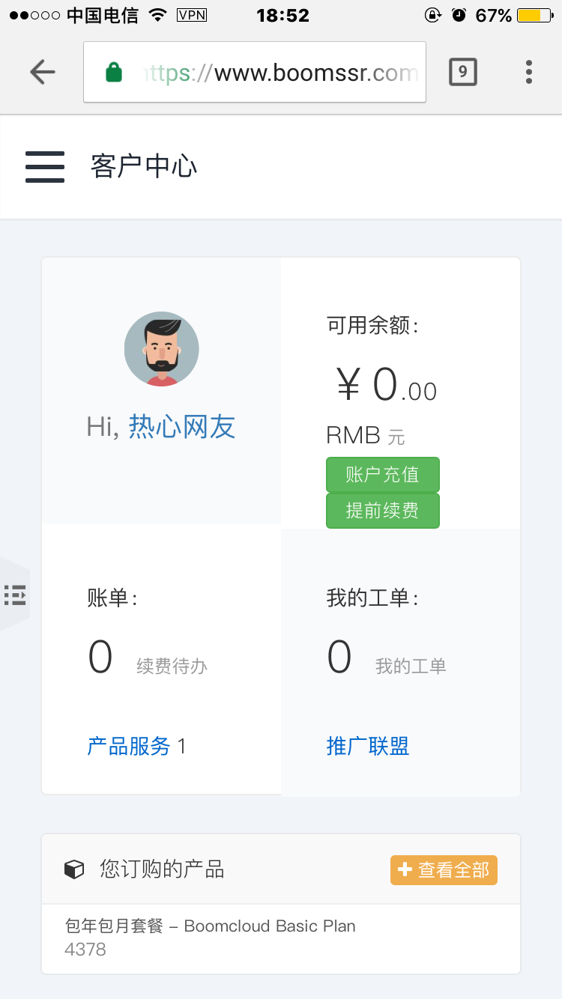
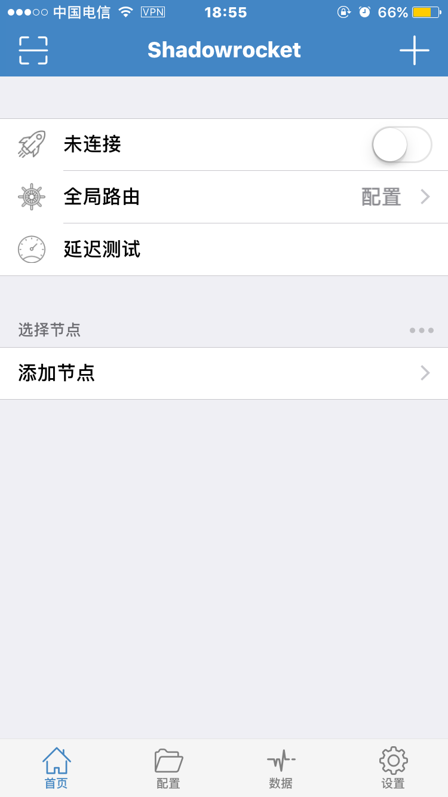
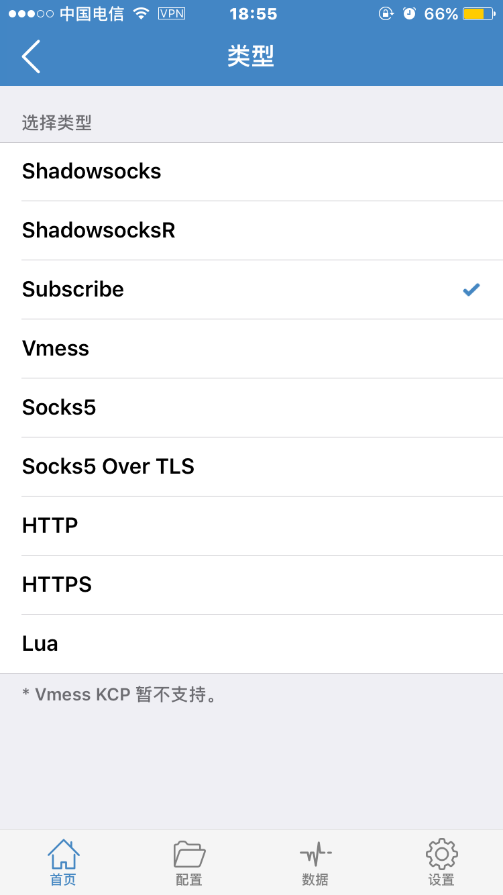
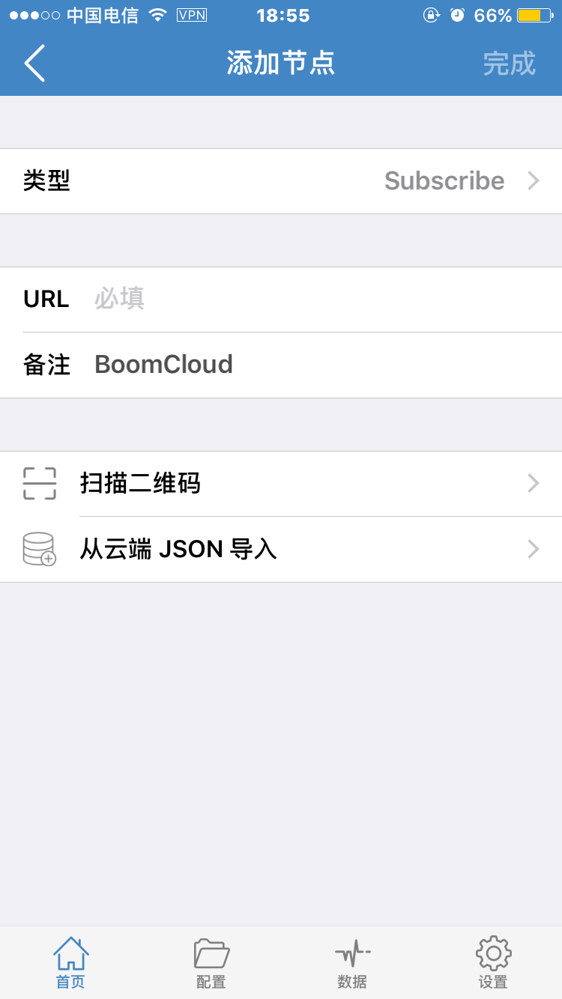
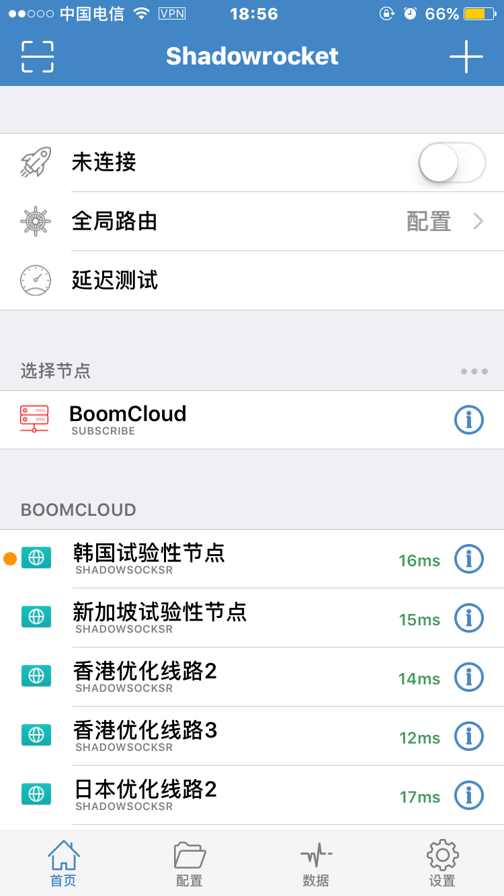
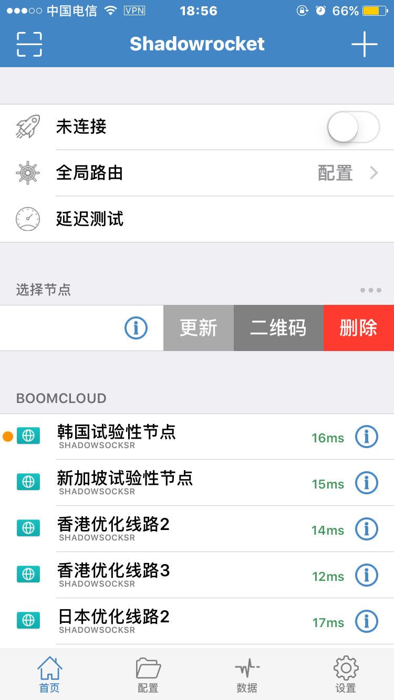

# 使用教程 —— Shadowrocket
- - - - -

Shadowrocket 是老牌 iOS 代理软件，在完整兼容 SSR 新协议的同时，也兼容 SS 配置文件的大部分语法但是其性能要低于 Quantumult 的稳定性，优点是使用简单容易上手。

 **购买须知：**

>1.目前此应用程序无法在中国大陆的 App Store 购买和下载，请阁下自备美区App Store帐号 ，购买此软件应用程序。  
2.此外，我司不提供任何共享账号，建议阁下通过其他渠道购买帐号或者自行注册。

** 1. 使用浏览器登录到 BoomCloud 管理门户**

登录用户中心，在"您订购的产品" 区域，找到已激活的产品服务。

点击进入产品详情页面。建议使用 Safari 管理门户，然后点击您的订阅进入订阅详情页面

** 2. 导入 Boom Cloud 接入点信息**

点击订阅打开订阅详情页面，然后找到「自动配置」功能区。然后点击「节点订阅」按钮，下拉中点击「普通模式」

点击之后会自动复制成功，部分浏览器会弹出提示

** 3. 在 Shadowrocket 中添加接入点信息订阅**

打开 Shadowrocket App，然后在主界面点击右上角的「+」号。

在新的页面中选择「Subscribe」类型。

在「URL」上轻触两次，选择「粘贴」，以将方才复制的 BoomCloud 接入点信息订阅地址粘贴到 Shadowrocket App 中，然后在「备注」中填写 「BoomCloud」,点击右上角完成。

Shadowrocket 会自动返回主界面并显示所有可用的接入点，这里是以 Boomcloud Basic Plan 订阅为例，不同的订阅可能会有不同的接入点。

默认地，Shadowrocket 会在每次程序启动时更新接入点订阅，用户可以在「设置 - 服务器订阅」中调整，也可以在订阅节点上左划，并在出现的菜单中点击「更新」，就可以立即请求 BoomCloud API 以获取最新接入点信息。

最后点击最上方的未连接后面的按钮，成功开启BoomCloud加速服务，下方节点列表中可以自由点击切换线路，寻找最适合您的高速线路

- - -

**注意事项：  **
1. 个人专属配置文件是你个人账号密码及节点的总集成，不能泄露给任何人及网络，以防止他人使用及知晓你的密码。  
2. 如果节点有更新，则需要先在APP中清空节点列表，然后在后台导入配置文件。  
3. Shadowrocket如果出现BUG请联系软件作者，BoomCloud无法解决客户端层面问题。
