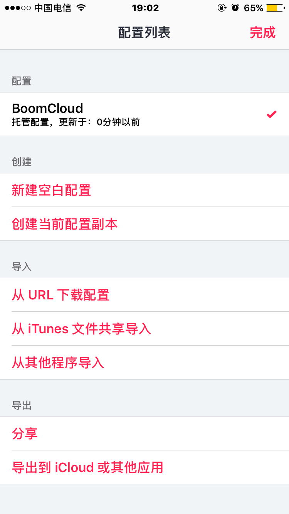
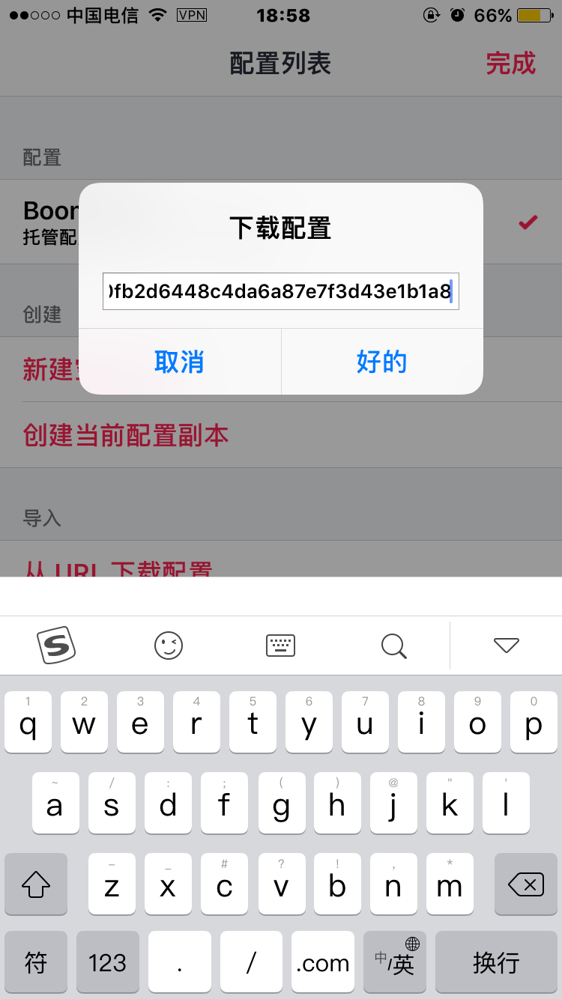
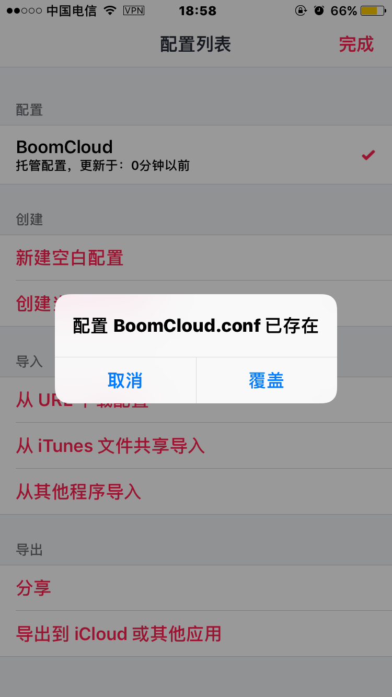
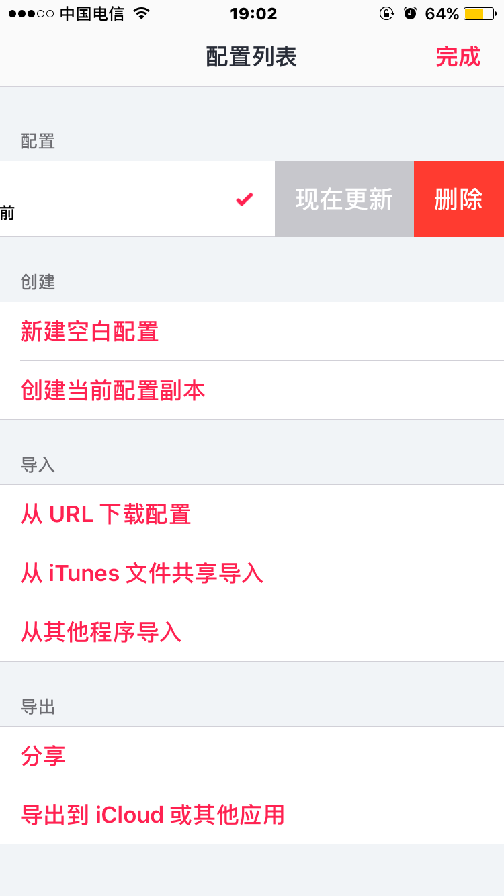

# 使用教程 —— Surge3

---
 **须知：**

>1.目前此应用程序无法在中国大陆的 App Store 购买和下载，请阁下自备美区App Store帐号 ，购买此软件应用程序。  
2.此外，我司不提供任何共享账号，建议阁下通过其他渠道购买帐号或者自行注册。

**1. 使用浏览器登录到 BoomCloud 管理门户**

建议使用 Safari 访问 BoomCloud 管理门户，然后点击您的订阅进入订阅详情页面。

**2.复制 BoomCloud 托管型配置 URL**

使滑动页面到「产品操作」的功能区

点击订阅打开订阅详情页面，找到「产品操作」功能区，然后点击「通用订阅」按钮，点击之后会自动复制托管链接至剪贴板，部分浏览器会弹出复制成功提示

**3. 在 Surge 中导入 BoomCloud 托管型配置**

打开 Surge 应用程序并打开「配置列表」

点击「从 URL 中下载配置」，然后粘贴刚刚复制的 URL

如果之前已经使用其他方法导入了 BoomCloud 配置文件，则会提示配置已经存在，请点击「覆盖」

如果之前未导入过 BoomCloud 配置，则会显示刚刚导入的配置文件

**4. 在 Surge 中更新 BoomCloud 托管型配置**

BoomCloud 的托管型配置文件默认三天更新一次，用户也可以在「配置列表」处强制更新配置文件，只需要在托管型配置上左划，点击「立即更新」即可

使用托管型配置后，用户就将无法更改配置文件中的任何内容。如需要更改，请复制一个配置文件副本。此外，也可以使用 Surge 的 Patch 特性来修订 [General] 部分的配置。

更改了连接密码后会导致托管型配置文件的 URL 失效，需要重新获取。

- - - 

**注意事项：**

1. 个人专属配置文件是你个人账号密码及节点的总集成，不能泄露给任何人及网络，以防止他人使用及知晓你的密码。    
2. 如果节点有更新，则直接在后台重新生成配置文件，然后在Surge下载一次配置文件覆盖即可。    
3. Surge如果出现BUG请联系软件作者，BoomCloud无法解决客户端层面问题。    

