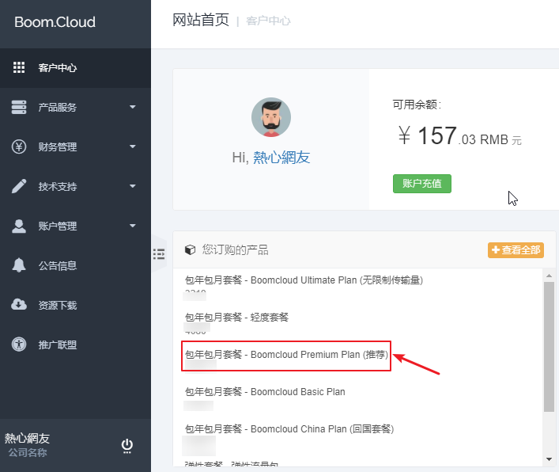
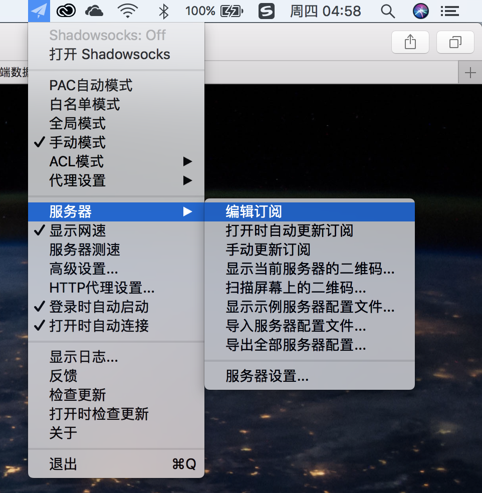
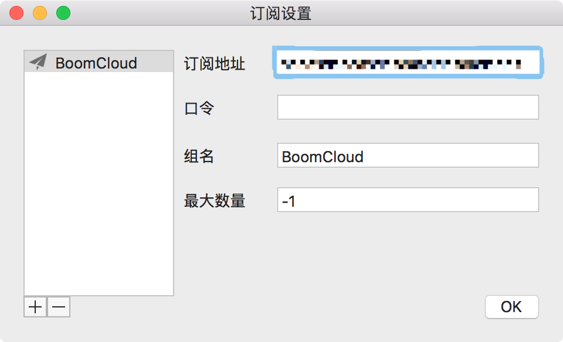
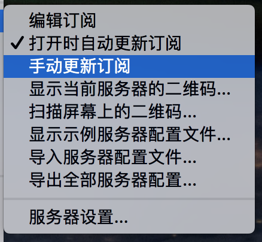
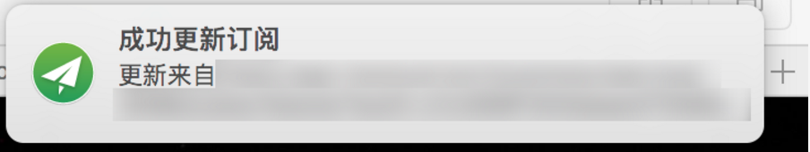
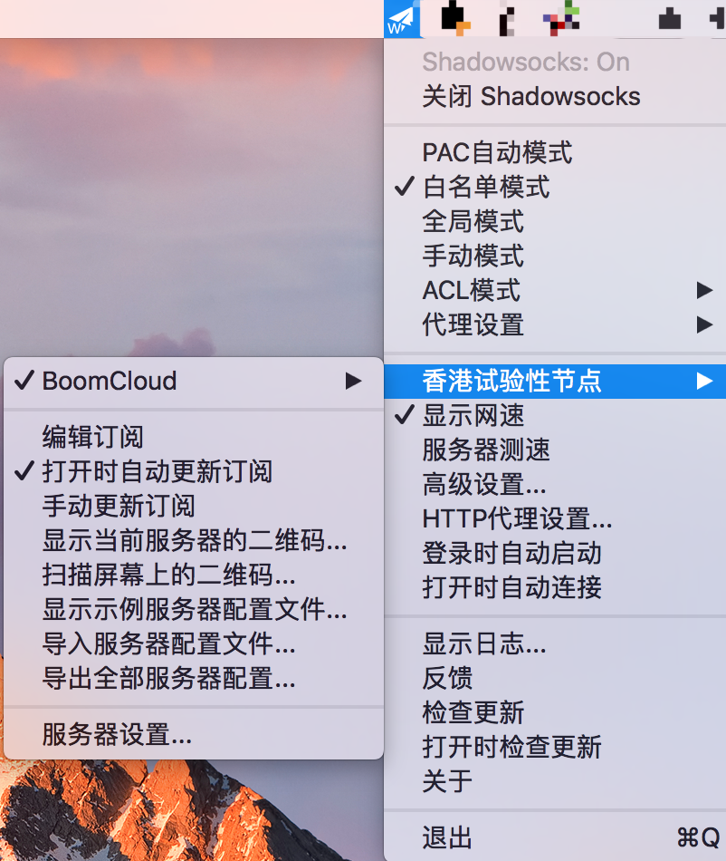
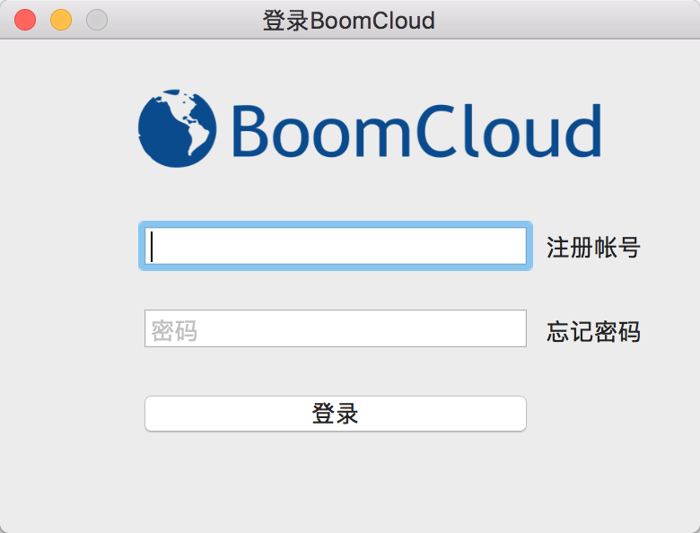
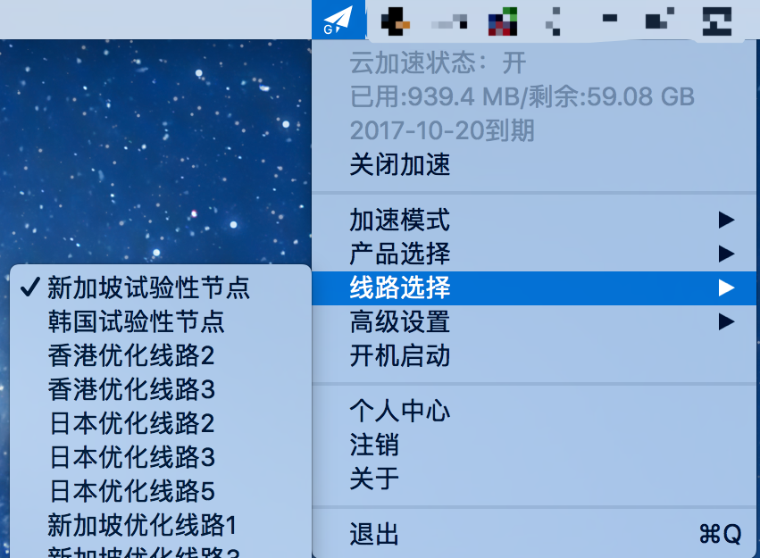

# 使用教程 —— Mac OS
- - -
### macOS平台使用方法一
**1. 使用桌面浏览器登录到 BoomCloud 管理门户**

登录用户中心，在"您订购的产品" 区域，找到已订购的产品,点击进入产品详情页面。建议使用 Safari 浏览器，然后点击您的订阅产品进入订阅详情页面

**2. 导入 Boom Cloud 接入点信息**

点击订阅打开订阅详情页面，然后找到「自动配置」功能区。然后点击「节点订阅」按钮，下拉中点击「普通模式」，点击之后会自动复制成功，部分浏览器会弹出提示

打开 ShadowsocksX-NG-R 应用程序，然后在顶部状态点击纸飞机图标，并按图中位置点击「编辑订阅」。

在弹出的窗口中点击左下角的「+」号，如果有弹出通知提示失败等信息请无视。并在弹出的窗口选中「订阅地址」的文本框，按下 「Command」+ V 键粘贴接入点信息订阅地址；然后在「组名」处填入「BoomCloud」，其他所有文本框无需填写或修改任何内容

在 ShadowsocksX-NG-R 应用程序菜单如图所示的位置中，勾选「打开时自动更新订阅」，然后点击「手动更新订阅」

如果您的网络可以正常访问 BoomCloud API，在几秒后就可以看到弹出的通知提示订阅更新成功。

**3. 为 macOS 设备开启 云加速 服务**

在 ShadowsocksX-NG-R 应用程序的菜单中选择「打开 Shadowsocks」，并选择一个代理模式，我们推荐使用「白名单模式」，并选择适合您使用的接入点，就可以享受 加速网络带来的国际网络访问体验了！

PAC 模式：自动代理模式，仅需要代理的流量通过服务器。  
全局代理模式： 所有流量通过服务器。  
白名单模式： 所有国外流量通过服务器。  

### macOS平台使用方法二
**1.下载BoomCloud for Mac客户端**

下载地址:[BoomCloud Wiki Center 全平台客户端下载地址](https://boomcloud-hk.github.io/wiki/#/resource/download)  

**2.安装客户端并登陆**

将下载好的客户端压缩包解压，然后安装，安装成功后双击加速器图标启动程序并登录BoomCloud门户账号，即您的邮箱及密码。

· 登录 Boomcloud 账户自动获取接入点信息  
· 自动获取套餐到期时间以及流量使用剩余信息  
· 适应多套餐用户，可自由自主切换套餐无需登录面板   
· 以 shadowsocksr-NG 方式运行

**3.开始科学上网**

登录之后软件会自动选择默认线路，如无法正常上网，您可以尝试切换线路

- - -
注意事项：  
1. 个人专属配置文件是你个人账号密码及节点的总集成，不能泄露给任何人及网络，以防止他人使用及知晓你的密码。   
2. 如果节点有更新，则需要再次导入配置文件进行更新。  
3. ShadowsocksX如果出现BUG请联系软件作者，BoomCloud无法解决客户端层面问题。  