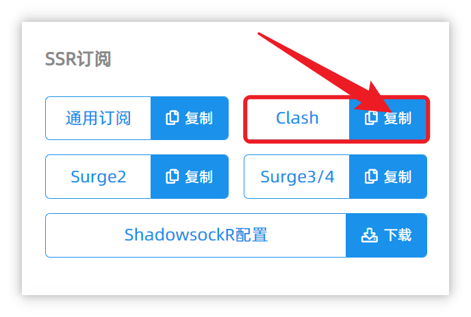
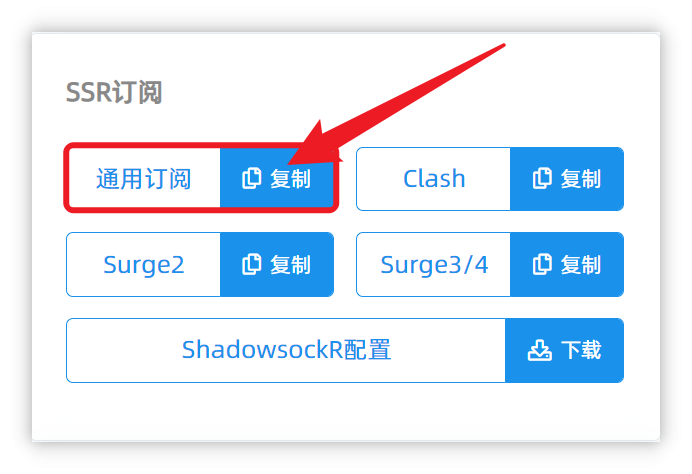

# 路由器使用简单说明 
- - -

> 由于路由器固件流派及版本众多，我们没有充足的测试环境以及测试硬件，所以无法提供非常详细的路由器的教程

这里需要指出，已知我们的订阅支持如下路由器`插件` ，但是请确保路由器插件均处于最新版本状态

1. openclash
2. koolclash
3. passwall
4. shadowsocksr plus

!> 注意：在以上插件使用中遇到任何问题请优先联系插件开发者、固件开发者、以及售卖给阁下路由器的商家而不是联系我们，联系我们您将不会获得任何技术支持。

## 使用方法

* 点击订阅打开订阅详情页面，然后找到「SSR订阅」功能区。然后点击「Clash」按钮。
此订阅适用于`openclash`及`openclash`插件

* 点击订阅打开订阅详情页面，然后找到「SSR订阅」功能区。然后点击「通用订阅」按钮。
此订阅适用于`passwall`及`shadowsocksr plus`插件

- - -
注意事项：  
1. 个人专属订阅是你个人账号密码及节点的总集成，不能泄露给任何人及网络，以防止他人使用及知晓你的密码。  
2. 如果节点有更新，则需要再次导入配置文件进行更新。  