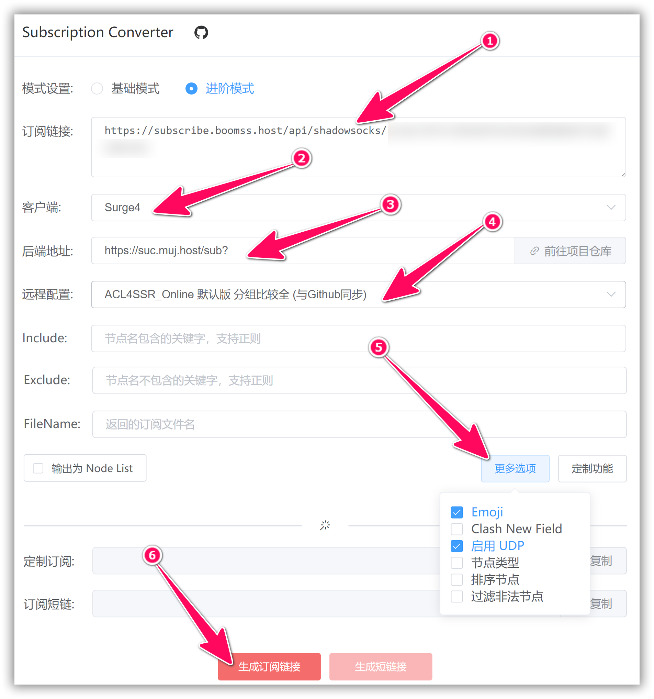

# 使用教程 —— Surfboard
- - -

!>系统环境： Android 12 / Surfboard 2.6.4(Build 107)

**概述**

Surfboard 是 Android 平台一款基于规则的代理客户端，提供对 Surge 配置文件的兼容并提供对 AEAD 算法的支持。

此应用程序上架 Google Play Store，但还停留在 1.x 版本许久未更新，目前 2.x 版本正在频繁更新测试中，需要到[官方 Telegram 频道](https://t.me/surfboardnews)中下载。2.x 版本相较于 1.x 版本在 UI 和功能等方面都有较多改进，虽然是测试版，但已足够稳定，无恶性 Bug，推荐使用新版本。同时，开发商已经[宣布](https://twitter.com/getsurfboard/status/1023485591839621120) Surfboard 未来将是一个「付费应用」，但具体授权方式及价格暂未公布。

Surfboard 支持 SS/SS-OBFS/Trojan/VMess/HTTP/SOCK5 等代理协议，**不支持 SSR 协议**，未来也大概率不会提供支持。

**注意事项：**  

!> BoomCloud 将提供关于此应用程序的配置和使用支持服务，然而，由于此应用程序并非 BoomCloud 开发，我们的支持人员培训程度也并不相同，我们建议如果用户使用过程中出现应用程序方面的问题，优先考虑询问开发者，或自行使用搜索引擎寻求解决方案。

---
**1. 登录 BoomCloud 用户中心**

建议使用 Chrome 浏览器，访问 BoomCloud 用户中心，在「您已激活的产品」区域，找到生效中的套餐，点击进入套餐管理页面。在节点订阅模块可以分别订阅 SSR/V2Ray 不同协议的节点，点击复制 Surge3/4 的订阅链接

**2. 导入 BoomCloud 接入点信息**

安装运行 Surfboard ，进入「配置文件」界面¹，点击右下角悬浮按钮²，选择`从 URL 导入`³

在输入框内粘贴订阅链接，点击`导入`按钮

导入成功后可通过长按或点击配置文件右侧三个点按钮¹对其重命名²

**3. 配置客户端**
进入「仪表盘」界面¹，点击右下角悬浮按钮²即可连接代理服务器，如果是首次连接，则系统会弹出权限提示框，请应用 VPN 连接权限

进入「代理」界面¹，点击右下角悬浮按钮²可对所有节点测试延迟，选择适合您的节点，您即可开启膜法网上之旅。

**4. 订阅转换**
BoomCloud 提供的配置文件仅包含一个 `select` 策略组，如有其他需求可参照[官方配置模板](https://manual.getsurfboard.com/config-template)自行编写配置文件，或者使用 BoomCloud 官方提供的[订阅转换 API](https://sub.muj.host/) 进行自定义

在`订阅链接`文本框输入订阅链接¹，`客户端`选择 Surge4²，选择 BoomCloud 提供的后端地址³，`远程配置`按需选择⁴，`Include` `Exclude`两项可对节点进行筛选，`更多选项`可进一步自定义⁵，一切就绪之后即可点击生成订阅链接按钮⁶，将生成的订阅链接粘贴至 Surfboard 导入

此为 Surfboard 简明教程，更多功能请参阅[官方文档](https://manual.getsurfboard.com/)，或求助于搜索引擎
- - -
注意事项：  
1. 个人专属配置文件是你个人账号密码及节点的总集成，不能泄露给任何人及网络，以防止他人使用及知晓你的密码。  
2. 如果节点有更新，则需要在订阅管理页面更新订阅。  
