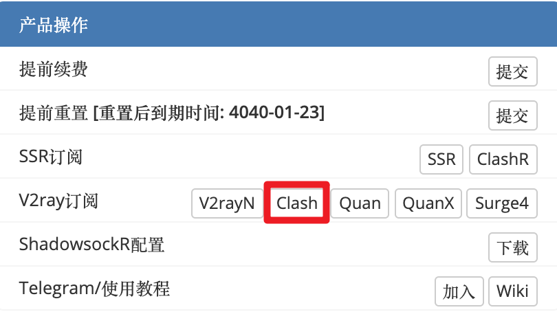
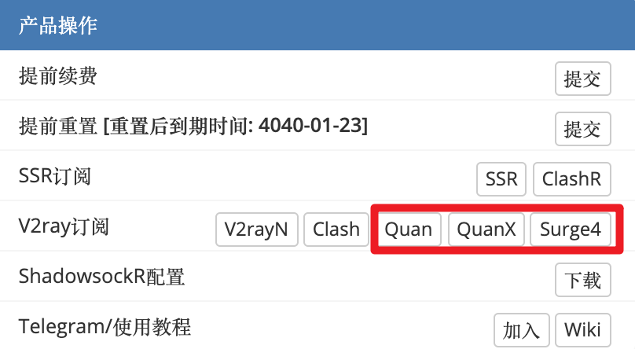

# V2ray全平台导入简单指引
- - -

!>目前V2ray服务还未正式上线，功能未到，文档先行  预计于2月底之前上线

**我们在所有订户的SSR产品中已经加入了V2ray支持，以及部分V2ray节点，由于V2ray与SSR协议不同，以及部分代理工具对多协议的支持有限，所以我们在这里简单列出全平台支持V2ray特性以及易用的代理工具以供所有订户参考以及更快速的导入。**

**1.Windows平台客户端推荐使用Clash for Windows**

- 下载地址：[下载1](https://cdn.t9c.co/download/Clash.for.Windows-0.8.8-win.7z)，[下载2](https://github.com/clash-windows/clash_for_windows_pkg/releases/download/0.8.8/Clash.for.Windows-0.8.8-win.7z)

复制订阅连接见图

- 导入步骤见[使用教程 - Windows Clash](/docs/clashwin)

**2.MacOS平台客户端推荐使用ClashX**

- 下载地址：[下载1](https://cdn.t9c.co/download/ClashX.dmg) [下载2](https://github.com/yichengchen/clashX/releases)

复制订阅连接见图

导入步骤见[使用教程 -  [MacOS Clash](/docs/clashx)

**3.iOS平台客户端推荐使用Quantumult、QuantumultX、Surge4**

复制订阅连接见图

- 导入步骤见[iOS - Surge3](/docs/ios-surge3)
- 导入步骤见[iOS - Quantumult](/docs/ios-quan)

**4.Android平台客户端推荐使用Clash for Android**

- 下载地址：[下载](https://cdn.t9c.co/download/clash1.0.32-alpha.apk)

复制订阅连接见图

- 导入步骤见[Android - ClashFA](/docs/clashfa)

