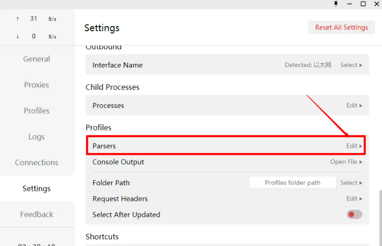
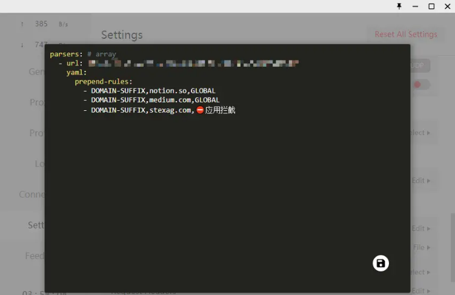

# Clash使用Parser添加自定义规则并防止更新覆盖
---

>Clash可以说是当下最好用的代理软件了，功能丰富，界面清爽，简单易用。但同样的Clash也面临着订阅规则不完善的情况，熟悉Clash的同学应该知道Clash提供了自定义新规则的功能界面，对于小白来说十分友好，但是这种方式有一个致命的缺陷，就是每一次更新订阅节点，自定义规则就会被覆盖，造成规则丢失。本文将介绍一种使用Clash的Parser功能，通过书写javascript代码，对订阅规则进行预处理的方式添加自定义规则，这种方式能够避免订阅更新造成的规则丢失。

方法详细介绍
Note: 使用该方法需要Clash版本高于0.11.10，如果低于该版本，请先上github下载安装包进行更新。
传送门： Clash下载地址

打开`Setting`（设置），找到`Profiles`（配置文件下）的`Parsers`。



点击右侧的`Edit`，打开编辑界面。



输入以下代码（以下为示例代码，需要根据自身情况进行改动）：


```
parsers: # array
  - url: https://subscribe.boomss.****/api/shadowsocks/clash/****/5f********************
    yaml:
      prepend-rules:
        - DOMAIN-SUFFIX,notion.so,BoomCloud
	    - DOMAIN-SUFFIX,medium.com,BoomCloud
```

复制代码
其中需要改动的有 `url` 和 `prepend-rules`。

!>url：修改为阁下的订阅链接，如果不知道，可以直接在`Profiles`下点击当前订阅的`Change imformation`，复制其中的URL即可。

!>prepen-rules 此处添加你的自定义规则，每一条占一行，按照规则类型，值，代理策略排列，使用逗号分隔。注意的是，每一行都需要以一个短横线 - 加一个空格开头，同时注意对齐。

具体的自定义规则如何书写此处不再说明，相信阁下能看到这里也一定有自行学习和书写规则的能力。

更多功能介绍请查阅 [Clash for Windows 官方文档](https://docs.cfw.lbyczf.com/contents/parser.html#%E7%89%88%E6%9C%AC%E8%A6%81%E6%B1%82ss) 或自行 Google
- - -
注意事项：  
1. 个人专属配置文件是你个人账号密码及节点的总集成，不能泄露给任何人及网络，以防止他人使用及知晓你的密码。    
2. Clash for Windows 如果出现 BUG 请联系软件开发者，BoomCloud 无法也没有义务解决客户端层面问题。