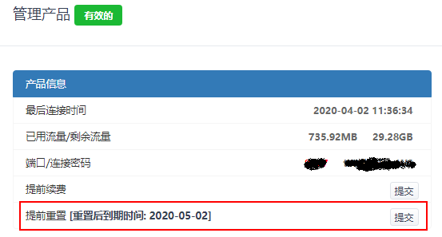

# 常见问题集锦 Q&A
---
## **1.  关于无法正常连接**

!>如果没有大量用户反应无法连接，当你无法连接的时候肯定是你自己的问题。可根据此QA来查询问题。
### 可能性一
* 检查DNS，并修改DNS。
* 修改DNS教程：
[Win7教程](http://jingyan.baidu.com/article/f71d60375584591ab641d13c.html)、[Win10教程](http://jingyan.baidu.com/article/1612d50058aa86e20e1eee96.html)、[Android教程](http://jingyan.baidu.com/article/77b8dc7f9ffc1d6174eab6a6.html)、[IOS教程](http://jingyan.baidu.com/article/6525d4b155877dac7d2e9499.html)、[Mac OS教程](http://jingyan.baidu.com/article/fc07f9891f626712ffe519cf.html)
* DNS建议修改为223.5.5.5、223.6.6.6或8.8.8.8

### 可能性二
SS/SSR没有配置好，建议参考<code>全平台使用教程</code>。

### 可能性三
套餐流量超出或者套餐到期。等待下个月流量重置或者续费套餐。

### 可能性四
正在使用的节点出现问题，切换节点后提交工单反馈。

### 可能性五
产品连接密码中包含了`特殊符号`导致无法连接，请登录用户中心修改连接密码`仅支持8位及以上数字字母组合`并复制新的订阅连接导入节点

### 可能性六
扫码导入节点时请看清楚阁下所选择的节点二维码是SS节点还是V2节点，请勿使用ssr软件扫描V2节点的二维码

### 可能性七
可能阁下当前选择的节点临时故障，请尝试切换其他节点连接(`真遇到过有人三个设备都是默认第一条线路，仅第一条线路临时故障来问我们为什么都连不上的`)

## **2. 关于流量重置问题**

### 流量重置时间
今天购买，下个月的今天重置。比如1月5号购买的，那么2月5号就是重置流量的日期

### 注意
流量用尽之后续费产品并不能充值流量，仅延迟产品有效期以及增加自动重置次数

## **3. 如何自助重置流量**

>目前我们提供了两种形式的重置流量

**A：支付少量费用重置流量（大约为月费用的85%）**

**B:扣除一个月使用时间重置流量**

## **4. 下载配置文件没反应**

* 连接密码出现乱码，修改连接密码后重试。
* 更换浏览器后重试，比如IE浏览器、Edge浏览器、Chrome浏览器、Firefox浏览器。

## **5. 其他问题**

* 更多问题可以在网站后台内提交工单，所有问题都可以提交工单解决，各部门的工作时间为工作日 10:00-17：00。您在工作时间内提交的问题，将在 24 小时内答复，48 小时内解决。 
 
---
