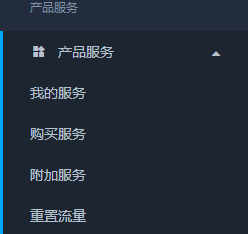

# 常见问题集锦 Q&A
---
## **1.  关于无法正常连接**

!>如果没有大量用户反应无法连接，当你无法连接的时候肯定是你自己的问题。可根据此QA来查询问题。
### 可能性一
* 检查DNS，并修改DNS。
* 修改DNS教程：
[Win7教程](http://jingyan.baidu.com/article/f71d60375584591ab641d13c.html)、[Win10教程](http://jingyan.baidu.com/article/1612d50058aa86e20e1eee96.html)、[Android教程](http://jingyan.baidu.com/article/77b8dc7f9ffc1d6174eab6a6.html)、[IOS教程](http://jingyan.baidu.com/article/6525d4b155877dac7d2e9499.html)、[Mac OS教程](http://jingyan.baidu.com/article/fc07f9891f626712ffe519cf.html)
* DNS建议修改为223.5.5.5、223.6.6.6或8.8.8.8

### 可能性二
代理软件没有配置好，建议参考<code>全平台使用教程</code>一字一句的逐行阅读操作。

### 可能性三
套餐流量超出或者套餐到期。等待下个月流量重置或者续费套餐。

### 可能性四
正在使用的节点出现问题，切换节点后提交工单反馈。

### 可能性五
产品连接密码中包含了`特殊符号`导致无法连接，请登录用户中心修改连接密码`仅支持8位及以上数字字母组合`并复制新的订阅连接导入节点

### 可能性六
导入节点时复制了错误的订阅连接，不同的订阅链接适用于不同的代理软件

### 可能性七
可能阁下当前选择的节点临时故障，请尝试切换其他节点连接(`真遇到过有人三个设备都是默认第一条线路，仅第一条线路临时故障来问我们为什么都连不上的`)

### Chrome 浏览器无法代理

此类通常是由于扩展程序插件导致.

尝试使用无痕模式访问

1. 在 Chrome 浏览器界面使用「快捷键」 打开无痕模式窗口(无痕模式不加载 Chrome 扩展程序)。

Windows快捷键: Ctrl+Shift+N

macOS快捷键: Shift+Command+N

2. 在无痕模式窗口访问 https://ip.skk.moe 查看是否代理成功。

如果问题得到解决，请逐个关闭 Chrome 的扩展程序，排查哪个扩展程序所致。

## **2. 关于流量重置问题**

### 流量重置时间
今天购买，下个月的今天重置。比如1月5号购买的，那么2月5号就是重置流量的日期

### 注意
流量用尽之后续费产品并不能充值流量，仅延迟产品有效期以及增加自动重置次数

## **3. 如何自助重置流量**

>目前我们提供了付费的重置流量服务

**A：支付少量费用重置流量（大约为月费用的85%）**

## **4. 下载配置文件没反应**

* 连接密码出现乱码，修改连接密码后重试。
* 更换浏览器后重试，比如IE浏览器、Edge浏览器、Chrome浏览器、Firefox浏览器。

## **5. 解决Mac安装软件的“已损坏，无法打开。 您应该将它移到废纸篓”问题**

一、允许“任何来源”开启

苹果从macOS Sierra 10.12 开始，已经去除了允许“任何来源”的选项，如果不开启“任何来源”的选项，会直接影响到无法运行的第三方应用。

所以开启“任何来源”的方法如下：
打开【启动台】，选择【终端】，输入：

`sudo spctl  --master-disable`

然后回车，继续输入密码（密码输入时是不可见的），然后回车。
接着打开【系统偏好设置】，选择【安全性与隐私】，选择【通用】，可以看到【任何来源】已经选定。

接着打开文件进行安装。

二、发现还是显示“已损坏，无法打开。 您应该将它移到废纸篓”，不急，接下来用这种方法：

在终端粘贴复制输入命令（注意最后有一个空格）：

`sudo xattr -r -d com.apple.quarantine `

先不要按回车！先不要按回车！先不要按回车！先不要按回车！
然后打开 “访达”（Finder）进入 “应用程序” 目录，找到该软件图标，将图标拖到刚才的终端窗口里面，会得到如下组合(如图所示)：

`sudo xattr -r -d com.apple.quarantine /Applications/XXXX.app`

回到终端窗口按回车，输入系统密码回车即可。
接着重新打开安装软件，就可以正常安装了。

## **6. Android 系统 Google play 无法代理**

* 方法一:

1. 打开手机里的设置（不是Google play里的设置）
2. 更多应用
3. 找到Google play不是（Google play 服务）
4. 点击清空全部数据（不是清空缓存）
5. 确定
之后重新打开Google play再次下载就好了

如果还不行,尝试方法二

* 方法二:
1. 先把wifi关了，
2. 然后改用4G下载，
3. 这时候会有提示是否等待wifi再下，
4. 你把仅WLAN下载的勾去掉，
5. 你会发现已经在正常下载了，然后再把wifi打开就好啦

如果还不行,切换个节点试试看，大多数人第一步就能解决了。

## **7. 其他问题**

* 更多问题可以在网站后台内提交工单，所有问题都可以提交工单解决，各部门的工作时间为工作日 10:00-17：00。您在工作时间内提交的问题，将在 24 小时内答复，48 小时内解决。 
 
---
