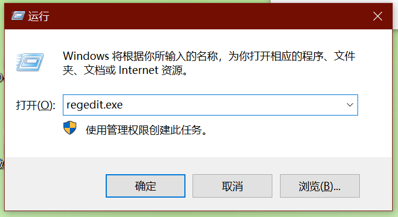
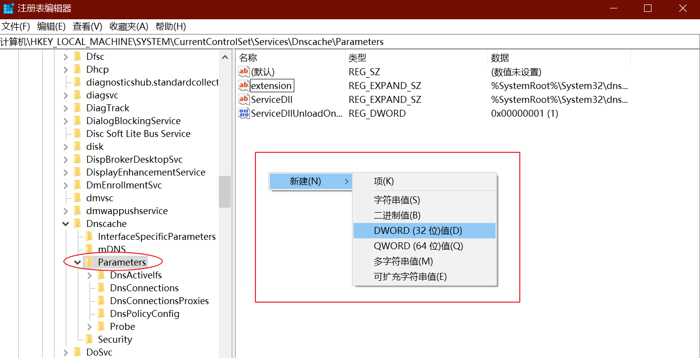
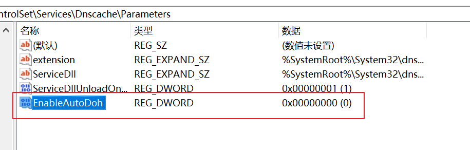
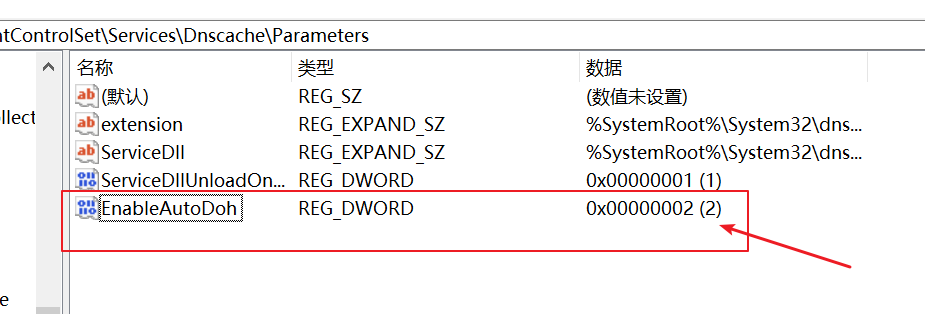
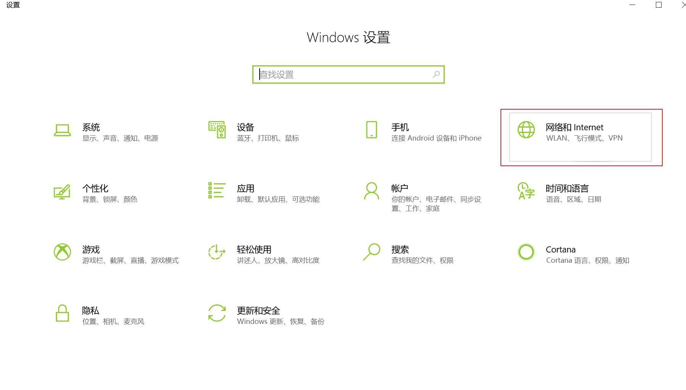
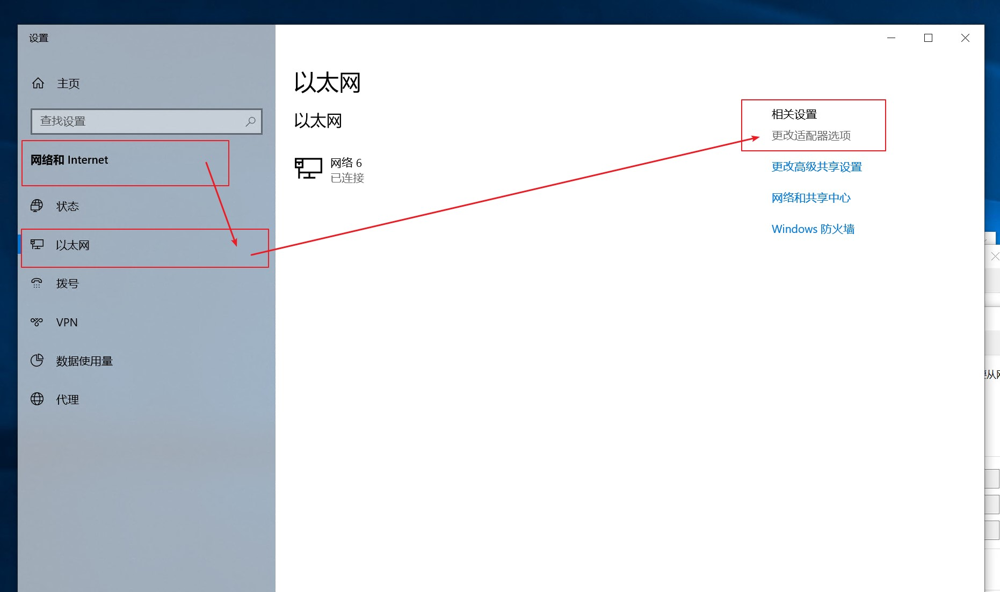
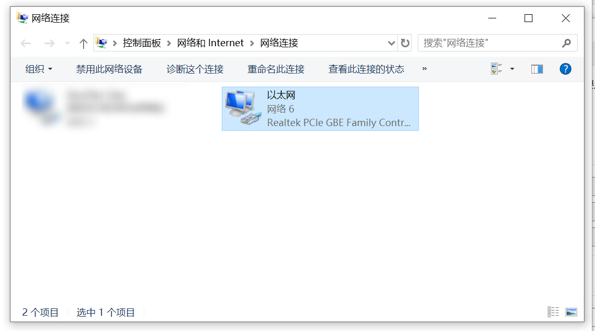
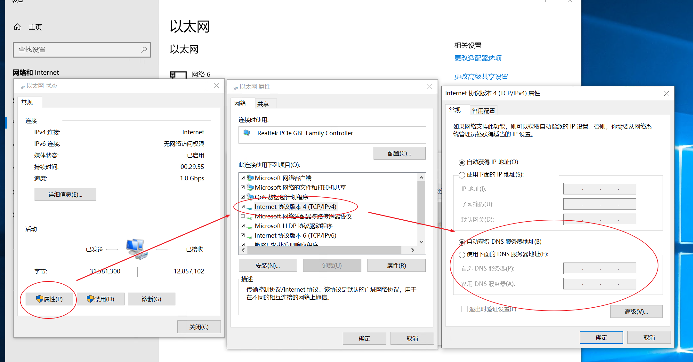
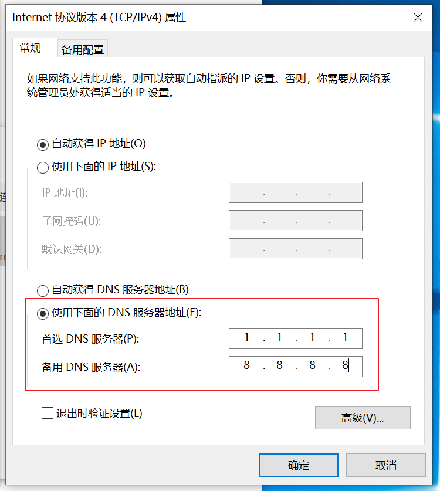

> 什么是DoH?

DoH 全称是 DNS over HTTPS 基于HTTPS的DNS查询服务。

>什么是DNS？

DNS：Domain Name System
域名解析服务，用于将域名与IP地址相互映射，方便访问互联网。

>什么是HTTPS？

HTTPS：Hyper Text Transfer Protocol over SecureSocket Layer
简单说就是，对于传输数据加密的超文本传输协议（HTTP）。

>为什么要用DNS over HTTPS？

一般在使用DNS服务时，传输的数据是纯文本，很容易被识别，然后被劫持并篡改，导致无法访问。
而使用DoH，传输的数据被加密了，因为无法得知所发的请求是什么，所以无法被篡改。

所以，简单说，DoH通过加密DNS请求，保证了域名的正常解析。

>如何配置DoH？

以Windows 10为例，Windows 10 2004 build 之后，系统已经自带DoH功能，只是默认没有打开，可以手动开启DoH。

手动开启Windows 10的DoH功能的详细步骤

## 1.修改注册表
按下 Windows + R 组合键，调出“运行”窗口，然后输入regedit.exe

即可打开注册表编辑器。

从左边的树形结构中，找到以下键：

`HKEY_LOCAL_MACHINE\SYSTEM\CurrentControlSet\Services\Dnscache\Parameters`

然后，创建一个新的DWORD类型键 EnableAutoDoh，值为2
具体步骤：

1). 在Parameters右边的空白区域点右键，选择新建->DWORD

2). 输入名字：`EnableAutoDoh`

3). 新创建的键，默认值是0，双击刚刚添加的EnableAutoDoh，修改值为2

4). 确认修改正确后，就可以关闭注册表了。

## 2.配置DNS

开启了DoH以后，还要配置一个支持DoH的DNS服务器。

具体步骤

1). 打开Windows设置
按下Windows键，或者直接点击左下角Windows图标，打开“开始”菜单，然后点击`设置`

2). 打开网络与Internet选项
从Windows设置中选中“网络与Internet”。

3). 点击左侧的以太网选项，然后选择右侧相关设置中的更改适配器选项

4). 打开以太网卡的DNS设置页面
从网络连接列表中，选择你的以太网卡

双击，打开以太网卡状态
点击属性按钮，打开以太网属性
在网络页面的列表中，选择Internet协议版本4(TCP/IPv4)
双击，打开Internet协议版本4(TCP/IPv4)属性页，可以看到DNS服务器设置

5). 手动设置DNS服务器地址
首选，CloudFlare的1.1.1.1
备选，谷歌的8.8.8.8

配置好后，点击确定关闭。

## 3. 重启DNS Client客户端服务
由于DNS Client服务无法直接手动重启，所以，直接重启电脑。

顺利的话，就完成了。